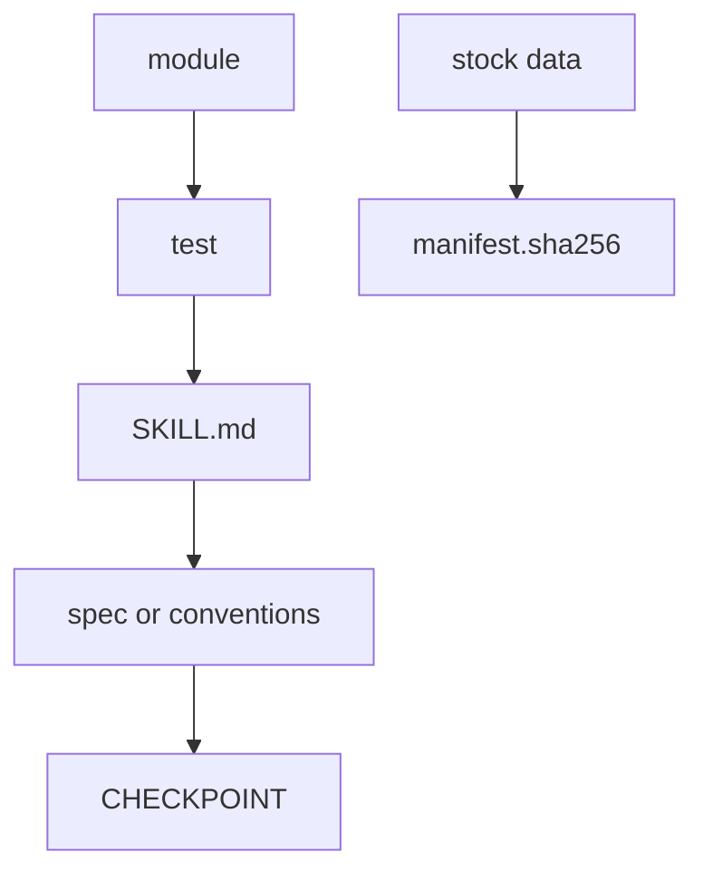

# Contributing to asrai

asrai records the judgments a human art director or technical artist makes, so they can be retrieved
and re-applied. It never replaces the judgment, and it never invents a magnitude. Almost every rule
below is that sentence, applied somewhere specific.

## Setup

```bash
uv sync --locked
uv run --no-sync pytest -q  # code, shipped corpus, and exact fixture values
```

The corpus validators run inside pytest, so a change to the shipped vocabulary fails the same command
a change to a module does. CI also checks repository links, translation stamps, commit signoffs and a
fresh wheel installation; see [the runbook](docs/runbook.md) for the complete landing procedure.

The runbook's judgment hierarchy governs changes: responsible human decisions and human-maintained
intent outrank derived specifications, which outrank code and tests. A conflict with the governing
document is an implementation defect, not permission to rewrite the document around the code.

## The five rules that will actually bite you

The full list is [docs/spec.md](docs/spec.md) §2 (invariants 1–14). These are the ones a change trips
over in practice:

1. **A number comes from a measurement, a precedent, or a human — never from a model and never from
   what the code currently prints.** If you add a threshold, the comment beside it names what measured
   it. "It looked right on my test image" is not a basis; measuring that image and saying so is.
2. **Silence is not agreement.** A measurement that could not be taken returns `unknown`, and an axis
   never reads `pass` on evidence it does not have. This is the single most common defect in this
   codebase's history — it has been fixed twice, at two different levels.
3. **Input bytes are immutable.** Every output is a new file under `out/`. Nothing in `measure.py` or
   `light.py` writes to a path it was given.
4. **Nothing is deleted or edited in place in the record corpus.** Records are appended; `supersedes`
   points at what a record replaces.
5. **Zero taste in stock.** The shipped vocabulary says what a term means and how it may be quantified.
   It never says what is good. Preference lives in a team's own records.

## What moves together

A change is not finished when the code passes. These travel in one commit:



- **module → test.** Non-trivial logic leaves one runnable check behind. Name it as a sentence about
  behaviour, and put the reason in the docstring.
- **module → `SKILL.md`.** No spec loss: a capability the tools have and the skill does not describe is
  shipped dead, because the agent never calls it. See [the skill README](src/asrai/data/skill/README.md).
- **a tool description → the budget.** A description is re-sent to the model on every turn; `SKILL.md` is
  read once. Keep the description to what picks the tool and shapes the call, and put the rest in the
  skill: the test warns above 1,000 tokens and fails above 1,200.
- **behaviour → contract.** A promise belongs in `spec.md`; a naming decision and its rejected
  alternatives belong in `conventions.md` §1a. Write the rejected alternative down — it is the cheapest
  thing in this repository and it stops the same argument recurring.
- **stock data → `manifest.sha256.json`.** Refresh the digest in the same commit; a test now fails if
  you forget.
- **a number in prose → `tests/claims.json`.** Any count a document states — terms, locales, tools,
  fixtures, a threshold — is registered there with what computes it and the wording that carries it.
- **a number in English prose → every translation of that document.** `docs/i18n/` mirrors a
  document, and the suite requires the same numeral in the mirror. Prose may lag behind its source and
  `tools/check_translations.py` says by how much; a number may not.
- **an image → where it came from.** Any image a change adds says its origin and its licence in the
  README of the directory it lands in. An image whose origin cannot be stated does not go in.
- **anything landing → a new `CHECKPOINT.md` entry.** That file is append-only: a stamped entry on top,
  nothing below it edited. Keep `last_acceptance_passed` truthful in the entry you add.
- **a rationale → a stamp.** Anything explaining *why* opens with `> YYYY-MM-DD · verified at <sha> ·
  <author>`, so a reader can tell how old the reasoning is without running `git log`.

## The three changes people actually make

**Adding a vocabulary term.** Edit `src/asrai/data/stock/vocab.v2.json`, add the head term to each
`locales/*.json`, refresh the manifest, then `uv run python tools/validate_stock.py` and
`tools/review_locales.py`. Set `quantification.mode` honestly: `proxy_only`, `qualitative`,
`relational` and `structural` can never take `set` or a delta, and `lint` will enforce that forever.

**Adding a surface to the lighting pass.** `surfaces.v1.json` first — id, `scope`, `decided_by`, one
atomic question, the ledger fields, and the vocabulary terms it records under. `decided_by` is the
honest part: `measurement` means a field settles it, `evidence` means the ledger measures *around* it
and a human answers, `observer` means nothing is measured and `unknown` is the default. The corpus test
checks that `ledger` is non-empty exactly for the non-observer tiers, and that the surface is named in
`SKILL.md`.

**Adding a measurement.** Deterministic and asset-wide goes in `measure.py`; anything needing a
subject, an emitter or an observer goes in `light.py`. If it changes what `measure` reports, the
fixture diff belongs in the same commit — see [tests/fixtures](tests/fixtures/README.md), and read that
file before regenerating anything.

## Before you open a pull request

- `uv sync --locked` and `uv run --no-sync pytest -q` are green.
- `uv run python tools/check_links.py` and `uv run python tools/check_translations.py` are clean.
  Neither runs inside pytest: a link and a translation are repository facts, not package behaviour.
- `uv run --no-sync python tools/check_wheel.py` passes. It checks a fresh installation and writes the
  generated release bundle under `dist/repro/`; use `--out` with a new directory for another run.
  The bundle and its supported reproducibility boundary are described in the runbook.
- Any new number names what measured it.
- Any new failure mode returns `unknown` rather than a default.
- The skill describes anything new an agent can now do.
- A rejected alternative for any new public name is written down.
- If you found a defect in a real asset, the regression test keeps the *real* magnitude. A perturbation
  at an invented strength proves nothing; the vignette that broke the shaded mass was 0.10, and it
  mattered precisely because that is invisible.
- Each commit message names every owner its diff touches. A file the message cannot account for rides in
  unread — a reviewer reads what the message points at — and the longest-lived defects in this
  repository's history sat in exactly such files, carried by one commit that never mentioned them.
  Give that file its own commit, or leave it out.
- Every commit is signed off (`git commit -s`). The `Signed-off-by` line is the
  [Developer Certificate of Origin](https://developercertificate.org/): you certify that you may submit
  the change under this repository's MIT licence, and nothing more. There is no CLA. Nothing is
  retroactive — commits before adoption carry no line. The PR check excludes the fixed pre-adoption
  history through `1ecfc08af7d1b9c6d009e80341638d97020ec815`; changing a commit date does not exempt it.
  The checker runs from the trusted default branch and never executes the proposed tree.

## What not to add

No plan files, progress notes, summaries, task lists or second checkpoints. They are indistinguishable
from a documentation contribution at review time, and a worktree does not hide them — a pull request
shows everything. Scratch goes outside the repository or under `*.scratch.md`; status goes in a
`CHECKPOINT.md` entry; reasoning goes in a dated `docs/review/` file. [`docs/runbook.md`](docs/runbook.md)
§3 is the full rule.

## Scope

Say no to: absolute aesthetic scores, summing the three axes, generating or repainting pixels, and any
correction that guesses at what a codec or an engine did. A lossy source is reported, not deringed; a
colour space is measured around, not declared. The answer to a degraded input is to ask for the
original.
