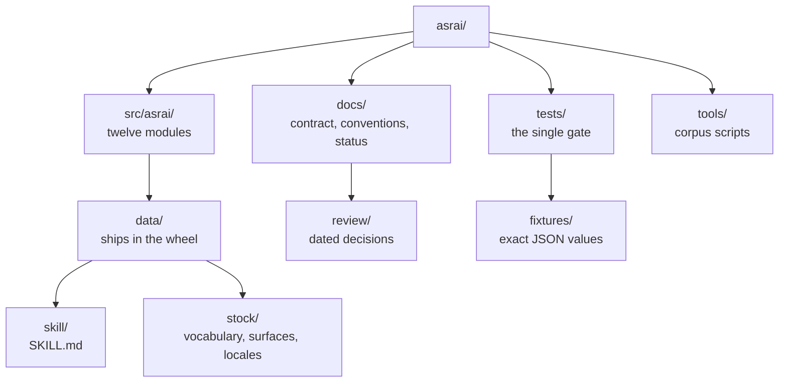

# asrai

First-pass art direction for game assets, for teams without a GPU. asrai records the judgments a human
art director or technical artist makes, so they can be retrieved and re-applied: deterministic
**measurement**, qualified **observation**, **precedent** retrieval, previewable **recipes**. It never
replaces the judgment and never invents a magnitude.

It ships as one Python package with a CLI and a stdio MCP server, plus a bundled `SKILL.md`, and works
in Claude Code, Codex CLI, OpenCode and Hermes Agent. The full contract is in [docs/spec.md](docs/spec.md).

This page in [한국어](docs/i18n/ko/README.md) · [日本語](docs/i18n/ja/README.md) · [简体中文](docs/i18n/zh-Hans/README.md) — drafts, unconfirmed by a native speaker of the industry's
language. English is canonical, and [why that is](docs/i18n/README.md) is worth two minutes.

## Status (0.1)

Built and tested: stock vocabulary v2 (475 terms, 12 languages), `measure` and `light_ledger` (Pillow + numpy),
append-only records with layer rules, instruction lint, `doctor` with a version lock, CLI and MCP.
Not built yet: recipes and previews, precedent retrieval, ingest and promotion, the pairwise bootstrap,
Blender rendering. The skill says so; agents should not improvise those steps.

## Install and register

```bash
uvx asrai doctor           # environment report; add --lock to write asrai.lock.json
uvx asrai skill-path       # where the bundled SKILL.md is
```

| host | MCP server | skill |
|---|---|---|
| Claude Code | `claude mcp add asrai -- uvx asrai mcp` | `cp "$(uvx asrai skill-path)" .claude/skills/asrai/SKILL.md` |
| Codex CLI | `codex mcp add asrai -- uvx asrai mcp` | add a section to `AGENTS.md` |
| OpenCode | in `opencode.json`: `"mcp": {"asrai": {"type": "local", "command": ["uvx", "asrai", "mcp"], "enabled": true}}` | add a section to `AGENTS.md` |
| Hermes Agent | in `~/.hermes/config.yaml`: `mcp_servers: {asrai: {command: uvx, args: [asrai, mcp]}}` | `~/.hermes/skills/asrai/SKILL.md` |

For a locked environment, follow the [release-bundle install procedure](docs/runbook.md#9-install-the-environment-a-release-was-checked-with).
It installs the tested wheel and hashed dependencies into a dedicated environment. Pinning only
`uvx asrai==<version>` does not lock its dependencies; `doctor --lock` records drift but does not enforce
the environment. [CHANGELOG.md](CHANGELOG.md) lists user-facing changes.

## Use

```bash
asrai vocab search "silhouette" --limit 5          # any language: --lang ko "실루엣"
asrai vocab get shape.silhouette --lang ja --no-full  # MCP: vocab_get(lookup=, full=false)
asrai measure sprites/orc_idle.png --target-width 96
asrai light-ledger captures/frame.png --capture captures/capture.json   # lighting pass: overlay under out/, form to fill
asrai light-ledger captures/frame.png --capture captures/capture.json --answers form.json   # verdict and record
asrai lint instruction.json
asrai record observation.json                       # appends to corpus/team/records.jsonl
asrai doctor --lock
```

MCP tools: `vocab_search`, `vocab_get`, `measure`, `light_ledger`, `record`, `lint`, `doctor`. Every verb prints or
returns one JSON document; nothing modifies an input file.

## Develop

```bash
uv sync --locked
uv run --no-sync pytest -q
uv run python tools/validate_stock.py   # also runs inside pytest; standalone for the full report
uv run python tools/review_locales.py   # flags translations a human still has to confirm
uv run python tools/make_fixtures.py    # rewrite tests/fixtures/expected/ after a deliberate change
```

`uv run pytest` covers the code, the shipped vocabulary, and exact JSON values from `measure` against
the committed fixtures. Start at [CONTRIBUTING.md](CONTRIBUTING.md) for all landing checks; conventions for
names and code are in [docs/conventions.md](docs/conventions.md).

## Repository map

Every directory carries a README saying what lives there and the one rule not to break.



| where | what |
|---|---|
| [`src/asrai/`](src/asrai/README.md) | the package: the CLI and MCP transports over ten core modules |
| [`src/asrai/data/`](src/asrai/data/README.md) | everything installed with the wheel |
| [`src/asrai/data/skill/`](src/asrai/data/skill/README.md) | the agent-facing `SKILL.md` and the no-spec-loss rule |
| [`src/asrai/data/stock/`](src/asrai/data/stock/README.md) | vocabulary v2, surfaces, schemas, the integrity manifest |
| [`src/asrai/data/stock/locales/`](src/asrai/data/stock/locales/README.md) | eleven locale bundles, one per language beside English — **contributions welcome** |
| [`src/asrai/data/stock/examples/`](src/asrai/data/stock/examples/README.md) | illustrative `instruction.v2` documents |
| [`tests/`](tests/README.md) | the suite, its conventions, and how to add to it |
| [`tests/fixtures/`](tests/fixtures/README.md) | six images, their expected output, and when regenerating is legitimate |
| [`tools/`](tools/README.md) | corpus validation, locale review, fixture generation |
| [`docs/`](docs/README.md) | which document is authoritative for what |
| [`docs/review/`](docs/review/README.md) | dated decision records, never edited |

[`docs/architecture.md`](docs/architecture.md) says which realm each of these belongs to and how far
its errors travel; the map above is for traversing the checkout.

The stock vocabulary is derived from an origin corpus with the learning layer removed; every entry keeps
`origin.entry_sha256`. Translations are LLM-drafted counterparts flagged for human confirmation.

MIT license.
