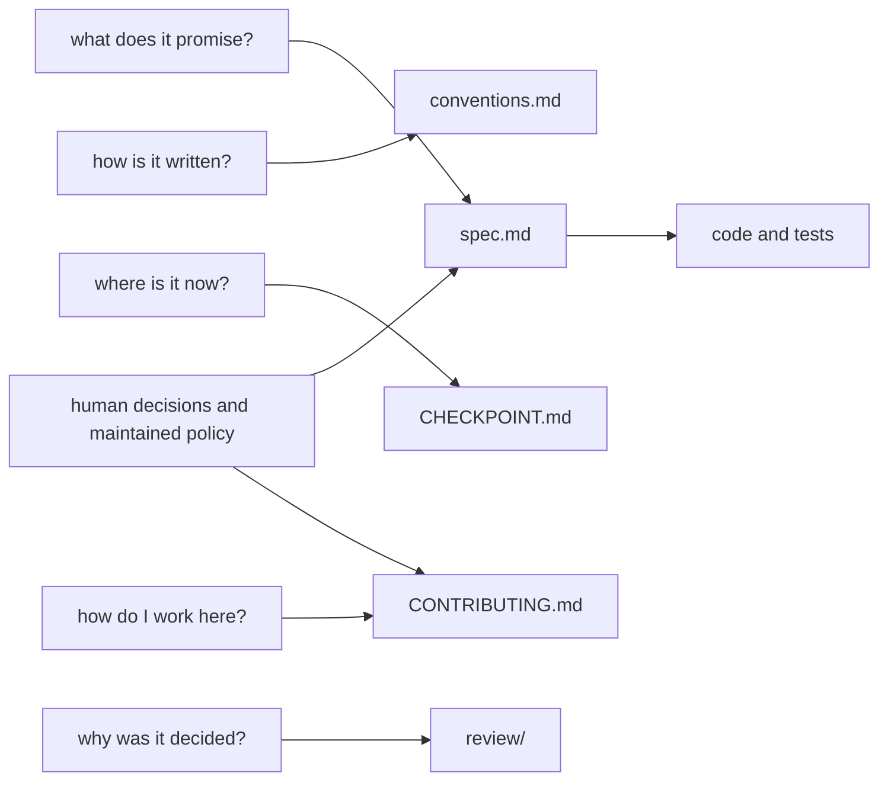

# `docs/` — the documents

The live documents answer different questions. [`runbook.md`](runbook.md) §1 owns the judgment
hierarchy: explicit human decisions, human-maintained documents, derived specs, then implementation.
AI-generated prose does not acquire human authority merely by living in a file named `spec.md`.

| document | question it answers | authority |
|---|---|---|
| [`spec.md`](spec.md) | what the tools promise, what a record means, what may never happen | **the implementation contract**, governed by human decisions and maintained policy. A conflicting implementation is defective |
| [`conventions.md`](conventions.md) | how code and names are written here, and which alternatives were rejected and why | binding on new code within the hierarchy in runbook §1; no filename overrides sourced human decisions or maintained policy |
| [`architecture.md`](architecture.md) | which realms this repository is partitioned into, how far each one's errors travel, who may write it and what checks it | the realm ledger, level 0. Each realm's interior is drawn one level down in its own README; existing defects shown there are not newly authorized |
| [`CHECKPOINT.md`](CHECKPOINT.md) | what is built, what passed, what is known to be limited, what a human still has to decide | a status log, **append-only**: a new entry on top, no entry below it edited. The newest is what is true now. Never a promise |
| [`../CONTRIBUTING.md`](../CONTRIBUTING.md) | how to make a change that will be accepted | human-maintained contribution policy; generated specs cannot override it |
| [`runbook.md`](runbook.md) | judgment hierarchy, operating policy and repeated procedures | the canonical location of the hierarchy; human decisions remain above it |
| [`review/`](review/) | why a decision was made, at the time it was made | historical. Dated, never edited — see its README. The pre-implementation playbook lives here too |

The current authority and release-boundary rationale is
[`2026-09-16-authority-and-release-gate.md`](review/2026-09-16-authority-and-release-gate.md).
It supersedes the older review index's description of CHECKPOINT as a rewritten snapshot; old reviews
and their historical index are preserved.

One more file sits at the repository root and is not a contract:

- [`../AGENTS.md`](../AGENTS.md) — the asrai section Codex CLI and OpenCode read in place of a skills
  directory (`spec.md` §12). It points at the bundled `SKILL.md` rather than restating it, so the two
  cannot drift. It also carries the three rules an agent breaks first — the hierarchy, the write-set
  boundary and the commit format — each linking to the document that owns it, and routes the documents
  themselves to the `repository-operating` skill, which governs their arrangement without saying
  what any of them contain.

## Language

Contracts and code comments are in **English**, which is canonical: term ids, field names, error
strings and the vocabulary's `en` bundle are the specification, and the eleven locale bundles only
rename head terms — one per language beside English, twelve languages in all. Every live document is English, and so is every README, including the two inside the wheel that
translators and corpus contributors read. `review/` is the one exception: those documents were written
on a day for named readers — an artist, a game designer, the author — and the rule that they are never
edited outranks the rule that documents are English, so the Korean ones stay Korean. A review written
today is written in English.

**Translating the README is a separate thing from the vocabulary's eleven locales.** The locales are a
feature of the product; a documentation translation is a contributor process, and matching their count
would mean eleven copies of prose that rots silently. The contract — `spec.md`, `conventions.md` — is
never translated, because a translated contract is a second source of truth.

Translations live in [`i18n/`](i18n/README.md): one directory per language, mirroring the repository
path of the source, each file stamped with the commit it was translated from.
`tools/check_translations.py` reports how far each has drifted, and the test suite holds a translation
to the same numbers as the file it mirrors. Three exist today — `ko`, `ja`, `zh-Hans`, all of the root
README — and a language or a document is added by adding a file, with no change to the tooling.

## Changing a document

`spec.md` marks decided items `[decided]`. Changing one of those is a contract change: it needs a
reason recorded in `review/` or in `conventions.md` §1a, and it usually needs a test. Everything
unmarked is still open and can be edited in the ordinary way.

`CHECKPOINT.md` is the one file expected to churn, and since 2026-09-15 it churns by growing rather than
by being rewritten: add an entry on top, stamped with the date, the revision its facts were checked at,
and the author, and leave every entry below it alone. Keep `last_acceptance_passed` truthful in the new
entry — it is the only place that says how many tests passed and what they covered. Because old entries
are frozen observations, `tests/claims.json` never anchors a number here.
