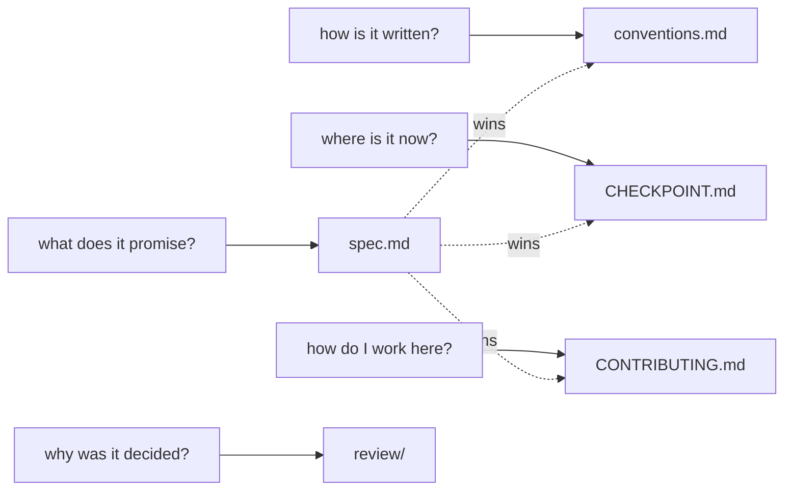

# `docs/` — the documents

Four live documents and a folder of dated reviews. They answer different questions and one of them
outranks the rest.

| document | question it answers | authority |
|---|---|---|
| [`spec.md`](spec.md) | what the tools promise, what a record means, what may never happen | **the contract.** When anything else disagrees with it, spec.md wins and the other file is amended |
| [`conventions.md`](conventions.md) | how code and names are written here, and which alternatives were rejected and why | binding on new code; subordinate to spec.md |
| [`CHECKPOINT.md`](CHECKPOINT.md) | what is built, what passed, what is known to be limited, what a human still has to decide | a status snapshot, rewritten as work lands. Never a promise |
| [`../CONTRIBUTING.md`](../CONTRIBUTING.md) | how to make a change that will be accepted | process, not contract |
| [`review/`](review/) | why a decision was made, at the time it was made | historical. Dated, never edited — see its README |

Two more files sit at the repository root and are not contracts:

- [`../ART_DIRECTION_SKILL_PLAYBOOK.md`](../ART_DIRECTION_SKILL_PLAYBOOK.md) — the procedure a team follows
  to routinise first-pass art direction. Written before implementation; the reasoning behind it is in
  `review/2026-09-13-art-direction-skill-scenario-review.md`.
- [`../AGENTS.md`](../AGENTS.md) — currently holds only web-research notes. `spec.md` §12 reserves this
  filename for the asrai skill section on Codex and OpenCode, so it will be rewritten; it is listed
  under `pending_human` in CHECKPOINT.

## Language

Contracts and code comments are in **English**, which is canonical: term ids, field names, error
strings and the vocabulary's `en` bundle are the specification, and the eleven locale bundles only
rename head terms — one per language beside English, twelve languages in all. The dated review
documents in `review/` are in **Korean**, because they were written for named readers — an artist, a
game designer — rather than for the record.

## Changing a document

`spec.md` marks decided items `[decided]`. Changing one of those is a contract change: it needs a
reason recorded in `review/` or in `conventions.md` §1a, and it usually needs a test. Everything
unmarked is still open and can be edited in the ordinary way.

`CHECKPOINT.md` is the one file expected to churn. Keep `last_acceptance_passed` truthful — it is the
only place that says how many tests passed and what they covered.
