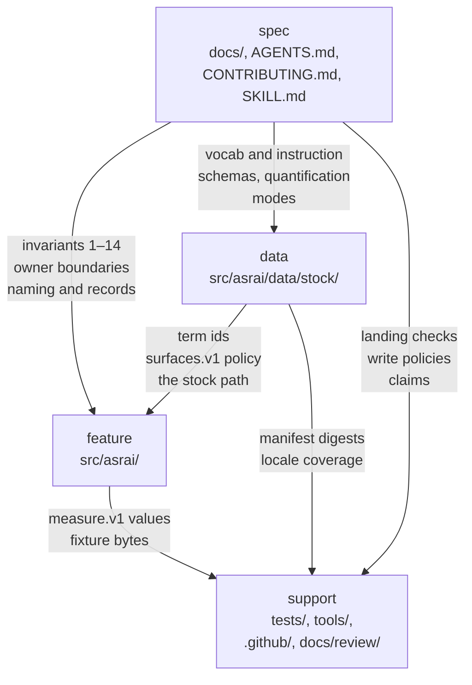

# Architecture — realms

The repository's level 0. A **realm** is a boundary that owns a class of invariant, and this page is
asrai's ledger of them: what each one owns, how far its errors travel, who may write it, and what
checks it. [Conventions §0](conventions.md#0-owner-boundaries) governs decomposition, the
[runbook](runbook.md#1-the-gate) governs authority, and the
[repository-operating skill](../.agents/skills/repository-operating/SKILL.md) defines what a realm is
and how this ledger is maintained.

Nothing here draws a realm's interior. Each realm's own document does, one level down, so no drawing on
this page grows as a realm does.

## Propagation

Arrows point the way an error travels: a defect in the tail reaches the head. `support` is the sink —
it carries other realms' evidence and nothing depends on it, which is why it owns no invariant of its
own. Labels name what actually crosses.

One realm in the ledger below is deliberately absent from this graph. `cache` holds projections of
another realm's records, kept because recomputing them costs something and discarded whenever that
cost is worth paying. No error travels from it, because nothing may depend on it that its source does
not also carry; a node with no arrow and no invariant would say only that it exists, which its row
already says. It is in the ledger so that a reader can tell a realm that was considered and owns
nothing from one that was forgotten.

## The ledger

| realm | extent | invariant it owns | who writes it | verified by | interior drawn in |
|---|---|---|---|---|---|
| **spec** | `docs/`, `AGENTS.md`, `CONTRIBUTING.md`, the bundled `SKILL.md` | what the repository promises and how it is governed | maintainer | review, [`claims.json`](../tests/claims.json), `check_links.py` | [`docs/README.md`](README.md) |
| **data** | [`src/asrai/data/stock/`](../src/asrai/data/stock/README.md) | the vocabulary means what it says in every language it ships | **the world** | `validate_stock.py`, `review_locales.py`, `manifest.sha256.json` | [`stock/README.md`](../src/asrai/data/stock/README.md) |
| **feature** | the rest of `src/asrai/` | deterministic behaviour behind two transports | maintainer | `pytest`, committed fixtures | [`src/asrai/README.md`](../src/asrai/README.md) |
| **support** | `tests/`, `tools/`, `.github/`, `docs/review/`, packaging | none of its own; it carries another realm's evidence | maintainer | the realm it serves | each directory's own README |
| **cache** | derived views beside a team's own records, none of it tracked here | none of its own, and one rule about itself: nothing may depend on it that its source does not also carry, so deleting it loses only time | whatever projects it, never a person | recomputation — the cache equals the projection of its source, or it is deleted | not drawn: it has no interior and nothing crosses out of it |

**Derivation and repair.** spec and feature are authored. data is **projected**: the stock vocabulary
comes from an origin corpus with the learning layer removed, and every entry keeps
`origin.entry_sha256`, so a correction is re-taken from that canon rather than edited here. support is
mixed, and [runbook §4](runbook.md#4-how-each-file-may-be-written) names each generated file —
`manifest.sha256.json` and `tests/fixtures/expected/` are regenerated, never hand-edited to quiet a
red test. When `corpus/packs/` lands (`spec.md` §5), it enters as a realm of its own whose writers this
repository cannot ask for a fix: its exit is **supersede**, since a team canonical already outranks a
pack by contract.

cache is projected too, and its repair is different in kind from data's. A wrong entry in data is
re-taken from a canon this repository does not hold; a wrong entry in a cache is **deleted**, and the
next read rebuilds it. That is what lets it own no invariant: there is no state in it that can be
wrong for longer than one recomputation, and a maintainer who is asked to repair one has found a bug
in the projection rather than in the cache. It follows that nothing may be written to a cache that
cannot be derived again, and that no document may cite one.

The bundled `SKILL.md` ships under `src/` and is spec: propagation decides a realm, never location.
`docs/review/` is support for the same reason — a frozen review is evidence about a decision, not the
decision's current statement, which lives in the realm the decision governs.

**data is the centre of gravity.** Every other realm is maintainable by one technical artist; the
vocabulary is not, because its correctness in twelve languages needs contributors this repository does
not employ. That is why the data realm is the one where duplication is permitted — the locale bundles
restate every head term by design — and the only one where a machine, not a reviewer, is what holds the
copies equal.

## Where the physical layout lives

[`README.md`](../README.md) draws the directory tree for someone traversing the checkout, and each
directory's README says what lives there. That map is navigation; this page is responsibility. A
directory can move without changing a realm, and two directories can share one.

The adaptation this ledger's owner rules came from is recorded in
[`review/2026-09-16-owner-boundaries.md`](review/2026-09-16-owner-boundaries.md).
