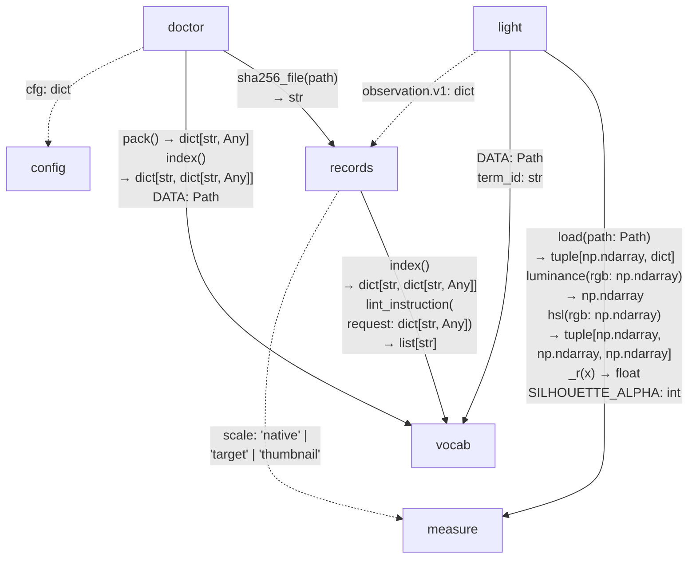

# Architecture — responsibility owners

asrai's job is first-pass art direction: turn asset evidence into measurements and qualified,
traceable observations for a human decision. [Conventions §0](conventions.md#0-owner-boundaries)
governs decomposition; the [runbook](runbook.md#1-the-gate) governs authority.

## Owner dependencies

Each node owns an invariant in the shipped Python core. Arrows point from consumer to provider;
labels contain only the signatures or data declarations crossing that boundary. Wrapped lines are
part of the same signature. `DATA: Path` and `SILHOUETTE_ALPHA: int` describe inferred constant types,
not newly declared interfaces. Solid edges include Python references; dashed edges are data-only
contracts, including values passed through transports. Each owner pair shares an edge, with all its
crossing signatures listed. `light` constructs observation dictionaries
that `records` validates when submitted; it does not call the validator or append records itself.

`doctor` consumes `config.load()` output through the transports, including `observer` and `_root`.
The scale literals accepted by `records` mirror the keys of `measure.v1.scales`. `light` uses
canonical vocabulary term IDs from surface policy and a literal ID in its observation builder;
the term-ID dependency remains even if the data directory moves. These are inferred data contracts,
not additional typed Python APIs. The transport boundary below makes its fan-out explicit without
counting it as extra product responsibilities. No core owner imports `cli.py` or `server.py`.

| owner | invariant | transport entry points |
|---|---|---|
| [`config`](../src/asrai/config.py) | project configuration overlays defaults and resolves the team corpus path | `load`, `team_dir` |
| [`vocab`](../src/asrai/vocab.py) | canonical term semantics and admissible instructions survive localized labels | `search`, `get`, `category`, `categories`, `langs`, `translations`, `lint_instruction` |
| [`measure`](../src/asrai/measure.py) | deterministic, bounded measurement preserves input bytes within the recorded decoder environment | `measure` |
| [`light`](../src/asrai/light.py) | subject/observer-dependent surface evidence preserves holds and states the basis of its judgments | `ledger` |
| [`records`](../src/asrai/records.py) | valid evidence records append without rewriting history | `append` |
| [`doctor`](../src/asrai/doctor.py) | environment drift is disclosed; writing the stamp requires an explicit request | `run` |

[`cli.py`](../src/asrai/cli.py) and [`server.py`](../src/asrai/server.py) adapt the same owners. Their
argument parsing, serialization and transport errors are not additional art-direction jobs.
`__init__.py` supplies version metadata. Stock vocabulary belongs to `vocab`; the surface policy
loaded from the stock directory belongs to `light`. Directory layout is not an ownership rule.
Helpers and dictionaries carry their owner's work; they do not own additional invariants.

## What this boundary currently exposes

- `light` imports `measure._r`, a private rounding helper, and `SILHOUETTE_ALPHA`. The private import
  violates the intended public boundary; drawing it records the defect rather than authorizing it.
- `light` reads its surface-policy file through `vocab.DATA`. That is a directory dependency, not a
  vocabulary lookup interface.
- `doctor` reaches `records` only for `sha256_file`. Environment reporting does not need the record
  lifecycle; the edge reflects where the generic helper currently lives.
- Observation dictionaries, configuration fields, scale keys and canonical term IDs cross owners
  without Python imports. The graph therefore cannot be recovered faithfully from an import count.

These are existing seams to address when their boundary is changed, not reasons to create new owners
or to refactor runtime code in a documentation change. The graph does not currently demand a subsystem
split. It does not establish that the lighting policies are empirically valid, or pre-approve retrieval,
rendering, recipes or publishing. Evaluate those proposals against the single job before adding them.

The adaptation and its exact source state are recorded in
[`review/2026-09-16-owner-boundaries.md`](review/2026-09-16-owner-boundaries.md).
