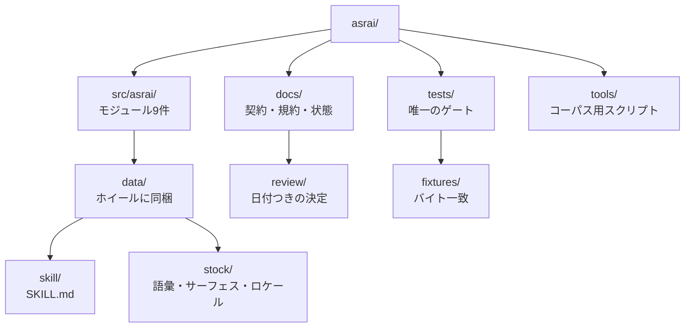

<!-- translation-of: README.md@b9ddb03e8d9bc54d263232d61e4a35968244c04d -->
> 原文 [README.md](../../../README.md) の翻訳です。**英語が正典**であり、食い違う箇所は原文が優先します。
> 翻訳が原文より遅れていないかは `uv run python tools/check_translations.py` が知らせます。

# asrai

GPU を持たないチームのための、ゲームアセットの一次アートディレクション。asrai は人間のアートディレクター
やテクニカルアーティストが下す判断を記録し、後から引き出して再適用できるようにします。決定論的な
**計測**、等級づけされた**観察**、**先例**の検索、プレビューできる**レシピ**。判断を代替せず、量を
でっち上げません。

CLI と stdio MCP サーバー、同梱の `SKILL.md` を備えた 1 つの Python パッケージとして配布され、
Claude Code、Codex CLI、OpenCode、Hermes Agent で動作します。契約の全文は
[docs/spec.md](../../spec.md) にあります。

## ステータス (0.1)

実装済みでテスト済み: ストック語彙 v2（用語475件、12言語）、`measure` と `light_ledger`（Pillow +
numpy）、レイヤー規則つきの追記専用レコード、instruction lint、バージョンロックつき `doctor`、CLI と
MCP。未実装: レシピとプレビュー、先例検索、取り込みと昇格、pairwise ブートストラップ、Blender による
レンダリング。スキル文書にその旨が書いてあるので、エージェントがその手順を即興で作ってはいけません。

## インストールと登録

```bash
uvx asrai doctor           # 環境レポート。--lock を付けると asrai.lock.json を書き出す
uvx asrai skill-path       # 同梱の SKILL.md の場所
```

| ホスト | MCP サーバー | スキル |
|---|---|---|
| Claude Code | `claude mcp add asrai -- uvx asrai mcp` | `cp "$(uvx asrai skill-path)" .claude/skills/asrai/SKILL.md` |
| Codex CLI | `codex mcp add asrai -- uvx asrai mcp` | `AGENTS.md` にセクションを追加 |
| OpenCode | `opencode.json` に: `"mcp": {"asrai": {"type": "local", "command": ["uvx", "asrai", "mcp"], "enabled": true}}` | `AGENTS.md` にセクションを追加 |
| Hermes Agent | `~/.hermes/config.yaml` に: `mcp_servers: {asrai: {command: uvx, args: [asrai, mcp]}}` | `~/.hermes/skills/asrai/SKILL.md` |

## 使い方

```bash
asrai vocab search "silhouette" --limit 5          # どの言語でも: --lang ja "シルエット"
asrai vocab get shape.silhouette --lang ja --compact  # MCP: vocab_get(lookup=, full=false)
asrai measure sprites/orc_idle.png --target-width 96
asrai light-ledger captures/frame.png --capture captures/capture.json   # ライティングパス: オーバーレイは out/ に、記入用フォームが出る
asrai light-ledger captures/frame.png --capture captures/capture.json --answers form.json   # 判定とレコード
asrai lint instruction.json
asrai record observation.json                       # corpus/team/records.jsonl に追記
asrai doctor --lock
```

MCP ツール: `vocab_search`、`vocab_get`、`measure`、`light_ledger`、`record`、`lint`、`doctor`。すべての
動詞は JSON 文書を 1 つ出力または返し、入力ファイルを書き換えるものはひとつもありません。

## 開発

```bash
uv sync
uv run pytest -q
uv run python tools/validate_stock.py   # pytest の中でも走る。全文レポートが欲しいときだけ単体で
uv run python tools/review_locales.py   # 人間の確認が要る翻訳に印をつける
uv run python tools/make_fixtures.py    # 意図的な変更のあと tests/fixtures/expected/ を書き直す
```

ゲートは `uv run pytest` ひとつだけです。コード、同梱の語彙、そしてコミット済みフィクスチャに対する
`measure` のバイト一致までまとめて見ます。出発点は [CONTRIBUTING.md](../../../CONTRIBUTING.md)、
名前とコードの規約は [docs/conventions.md](../../conventions.md) にあります。

## リポジトリの地図

すべてのディレクトリに README があり、そこに何が住んでいるかと、破ってはいけない規則がひとつ書いてあります。



| どこ | なに |
|---|---|
| [`src/asrai/`](../../../src/asrai/README.md) | パッケージ本体。コアモジュール 7 つの上にトランスポート 2 つ |
| [`src/asrai/data/`](../../../src/asrai/data/README.md) | ホイールと一緒に入るものすべて |
| [`src/asrai/data/skill/`](../../../src/asrai/data/skill/README.md) | エージェントが読む `SKILL.md` と、仕様を落とさない規則 |
| [`src/asrai/data/stock/`](../../../src/asrai/data/stock/README.md) | 語彙 v2、サーフェス、スキーマ、整合性マニフェスト |
| [`src/asrai/data/stock/locales/`](../../../src/asrai/data/stock/locales/README.md) | 英語以外の言語ごとに 1 つ、ロケールバンドル11件 |
| [`src/asrai/data/stock/examples/`](../../../src/asrai/data/stock/examples/README.md) | 例示用の `instruction.v2` 文書 |
| [`tests/`](../../../tests/README.md) | スイートとその流儀、そして何をどう足すか |
| [`tests/fixtures/`](../../../tests/fixtures/README.md) | 画像6枚とその期待出力、そして再生成が正当な場合 |
| [`tools/`](../../../tools/README.md) | コーパス検証、ロケールレビュー、フィクスチャ生成 |
| [`docs/`](../../README.md) | どの文書が何について権威を持つか |
| [`docs/review/`](../../review/README.md) | 日付つきの決定記録。決して書き換えない |

構成: `src/asrai/` のコア（`vocab`, `measure`, `records`, `doctor`, `config`, `cli`, `server`）、
`src/asrai/data/stock/` の語彙とロケール（貢献歓迎: `locales/README.md`）、
`src/asrai/data/skill/SKILL.md`、`tools/` の検証スクリプト、契約である `docs/spec.md`、
`docs/CHECKPOINT.md`。

ストック語彙は学習レイヤーを取り除いた原コーパスから派生しており、全項目が `origin.entry_sha256` を
保持しています。翻訳は LLM が下書きした対応語で、人間の確認待ちとして印がついています。

MIT ライセンス。
