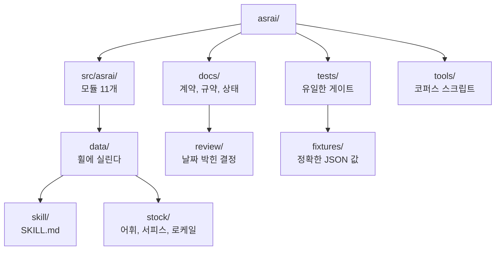

<!-- translation-of: README.md@250a3358d33036001aa1cf25f6d0b9de4214bbb4 -->
> 원문 [README.md](../../../README.md)의 번역이다. **영어가 정본이며**, 어긋나는 곳은 원문이 이긴다.
> 번역이 원문보다 뒤처졌는지는 `uv run python tools/check_translations.py`가 알려준다.

# asrai

GPU 없는 팀을 위한 게임 에셋 1차 아트 디렉션. asrai는 사람 아트 디렉터나 테크니컬 아티스트가 내리는
판단을 기록해 두었다가 다시 꺼내 쓰고 다시 적용할 수 있게 한다. 결정론적 **측정**, 등급이 붙은
**관찰**, **선례** 검색, 미리 볼 수 있는 **레시피**. 판단을 대신하지 않고, 크기를 지어내지 않는다.

파이썬 패키지 하나로 CLI와 stdio MCP 서버, 그리고 함께 담긴 `SKILL.md`를 제공하며 Claude Code,
Codex CLI, OpenCode, Hermes Agent에서 동작한다. 전체 계약은 [docs/spec.md](../../spec.md)에 있다.

## 상태 (0.1)

만들었고 테스트했다: 스톡 어휘 v2(용어 475개, 12개 언어), `measure`와 `light_ledger`(Pillow + numpy),
레이어 규칙이 붙은 append-only 레코드, instruction lint, 버전 락이 딸린 `doctor`, CLI와 MCP.
아직 없다: 레시피와 미리보기, 선례 검색, 인제스트와 승격, pairwise 부트스트랩, Blender 렌더링.
스킬 문서가 없다고 명시하므로, 에이전트는 그 단계들을 임의로 지어내면 안 된다.

## 설치와 등록

```bash
uvx asrai doctor           # 환경 리포트. --lock을 붙이면 asrai.lock.json을 쓴다
uvx asrai skill-path       # 함께 담긴 SKILL.md의 경로
```

| 호스트 | MCP 서버 | 스킬 |
|---|---|---|
| Claude Code | `claude mcp add asrai -- uvx asrai mcp` | `cp "$(uvx asrai skill-path)" .claude/skills/asrai/SKILL.md` |
| Codex CLI | `codex mcp add asrai -- uvx asrai mcp` | `AGENTS.md`에 섹션 추가 |
| OpenCode | `opencode.json`에: `"mcp": {"asrai": {"type": "local", "command": ["uvx", "asrai", "mcp"], "enabled": true}}` | `AGENTS.md`에 섹션 추가 |
| Hermes Agent | `~/.hermes/config.yaml`에: `mcp_servers: {asrai: {command: uvx, args: [asrai, mcp]}}` | `~/.hermes/skills/asrai/SKILL.md` |

환경을 고정하려면 [릴리스 번들 설치 절차](../../runbook.md#9-install-the-environment-a-release-was-checked-with)를
따른다. 검증된 휠과 해시가 박힌 의존성을 전용 환경에 설치한다. `uvx asrai==<version>`만 고정해서는
의존성까지 고정되지 않으며, `doctor --lock`은 드리프트를 기록할 뿐 환경을 강제하지 않는다.
사용자에게 영향을 주는 변경은 [CHANGELOG.md](../../../CHANGELOG.md)에 있다.

## 사용

```bash
asrai vocab search "silhouette" --limit 5          # 어떤 언어든: --lang ko "실루엣"
asrai vocab get shape.silhouette --lang ja --no-full  # MCP: vocab_get(lookup=, full=false)
asrai measure sprites/orc_idle.png --target-width 96
asrai light-ledger captures/frame.png --capture captures/capture.json   # 라이팅 패스: 오버레이는 out/에, 채울 폼이 나온다
asrai light-ledger captures/frame.png --capture captures/capture.json --answers form.json   # 판정과 레코드
asrai lint instruction.json
asrai record observation.json                       # corpus/team/records.jsonl에 append
asrai doctor --lock
```

MCP 도구: `vocab_search`, `vocab_get`, `measure`, `light_ledger`, `record`, `lint`, `doctor`. 모든 동사는
JSON 문서 하나를 출력하거나 반환하며, 입력 파일을 고치는 것은 하나도 없다.

## 개발

```bash
uv sync --locked
uv run --no-sync pytest -q
uv run python tools/validate_stock.py   # pytest 안에서도 돈다. 전체 리포트가 필요할 때만 따로 실행
uv run python tools/review_locales.py   # 사람이 확인해야 할 번역을 표시한다
uv run python tools/make_fixtures.py    # 의도적으로 바꾼 뒤 tests/fixtures/expected/를 다시 쓴다
```

`uv run pytest`는 코드, 함께 담긴 어휘, 그리고 커밋된 픽스처에 대한 `measure`의 정확한 JSON 값을 본다.
랜딩에 필요한 검사 전체는 [CONTRIBUTING.md](../../../CONTRIBUTING.md)에서 시작하고,
이름과 코드 규약은 [docs/conventions.md](../../conventions.md)에 있다.

## 저장소 지도

모든 디렉터리에 README가 있고, 거기 무엇이 사는지와 깨면 안 되는 규칙 하나가 적혀 있다.



| 어디 | 무엇 |
|---|---|
| [`src/asrai/`](../../../src/asrai/README.md) | 패키지. 코어 모듈 9개 위에 트랜스포트 2개 |
| [`src/asrai/data/`](../../../src/asrai/data/README.md) | 휠과 함께 설치되는 모든 것 |
| [`src/asrai/data/skill/`](../../../src/asrai/data/skill/README.md) | 에이전트가 읽는 `SKILL.md`와 스펙 누락 금지 규칙 |
| [`src/asrai/data/stock/`](../../../src/asrai/data/stock/README.md) | 어휘 v2, 서피스, 스키마, 무결성 매니페스트 |
| [`src/asrai/data/stock/locales/`](../../../src/asrai/data/stock/locales/README.md) | 영어를 뺀 언어마다 하나씩, 로케일 번들 11개 — **기여 환영** |
| [`src/asrai/data/stock/examples/`](../../../src/asrai/data/stock/examples/README.md) | 예시용 `instruction.v2` 문서 |
| [`tests/`](../../../tests/README.md) | 스위트, 그 규약, 그리고 여기에 무엇을 어떻게 더하는지 |
| [`tests/fixtures/`](../../../tests/fixtures/README.md) | 이미지 6개와 그 기대 출력, 그리고 재생성이 정당한 경우 |
| [`tools/`](../../../tools/README.md) | 코퍼스 검증, 로케일 리뷰, 픽스처 생성 |
| [`docs/`](../../README.md) | 어떤 문서가 무엇에 대해 권위를 갖는지 |
| [`docs/review/`](../../review/README.md) | 날짜가 박힌 결정 기록. 절대 고치지 않는다 |

위 항목이 각각 어느 realm에 속하고 그 오류가 어디까지 번지는지는
[`docs/architecture.md`](../../architecture.md)가 말한다. 위 지도는 체크아웃을 훑기 위한 것이다.

스톡 어휘는 학습 레이어를 걷어낸 원본 코퍼스에서 파생했고, 모든 항목이 `origin.entry_sha256`을 유지한다.
번역은 LLM이 초안을 잡은 대응어이며 사람의 확인이 필요하다고 표시되어 있다.

MIT 라이선스.
