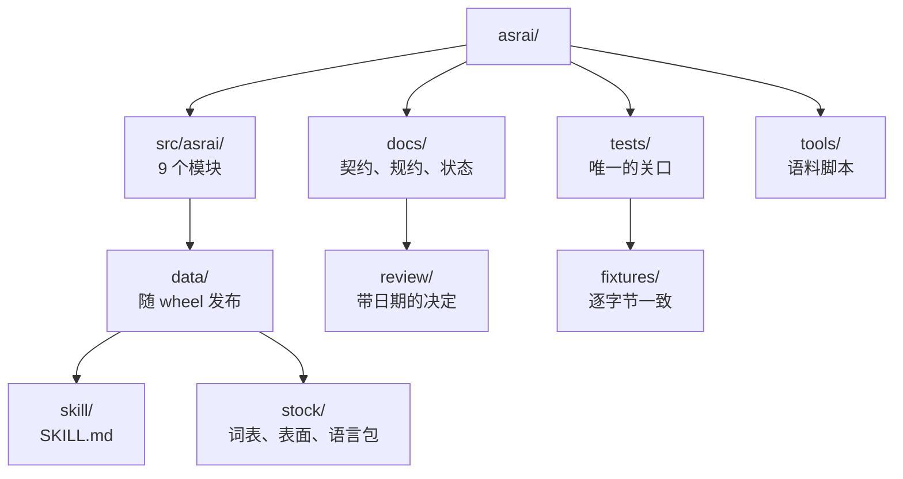

<!-- translation-of: README.md@b9ddb03e8d9bc54d263232d61e4a35968244c04d -->
> 本文是原文 [README.md](../../../README.md) 的翻译。**英文为正本**，如有出入以原文为准。
> 译文是否落后于原文，由 `uv run python tools/check_translations.py` 给出。

# asrai

面向没有 GPU 的团队的游戏资产初轮美术指导。asrai 记录人类美术指导或技术美术做出的判断，使其可以被
重新取出、重新应用：确定性的**测量**、带限定级别的**观察**、**先例**检索、可预览的**配方**。它不替代
判断，也不凭空编造量值。

它以一个 Python 包的形式发布，带 CLI 和 stdio MCP 服务器，并随附 `SKILL.md`，可在 Claude Code、
Codex CLI、OpenCode 与 Hermes Agent 中使用。完整契约见 [docs/spec.md](../../spec.md)。

## 状态 (0.1)

已构建并测试：库存词表 v2（术语475条、12种语言）、`measure` 与 `light_ledger`（Pillow + numpy）、
带层级规则的只追加记录、instruction lint、带版本锁的 `doctor`、CLI 与 MCP。
尚未构建：配方与预览、先例检索、导入与升级、pairwise 引导、Blender 渲染。
技能文档已写明这一点；智能体不应自行编造这些步骤。

## 安装与注册

```bash
uvx asrai doctor           # 环境报告；加 --lock 会写出 asrai.lock.json
uvx asrai skill-path       # 随附 SKILL.md 的位置
```

| 宿主 | MCP 服务器 | 技能 |
|---|---|---|
| Claude Code | `claude mcp add asrai -- uvx asrai mcp` | `cp "$(uvx asrai skill-path)" .claude/skills/asrai/SKILL.md` |
| Codex CLI | `codex mcp add asrai -- uvx asrai mcp` | 在 `AGENTS.md` 中添加一节 |
| OpenCode | 在 `opencode.json` 中：`"mcp": {"asrai": {"type": "local", "command": ["uvx", "asrai", "mcp"], "enabled": true}}` | 在 `AGENTS.md` 中添加一节 |
| Hermes Agent | 在 `~/.hermes/config.yaml` 中：`mcp_servers: {asrai: {command: uvx, args: [asrai, mcp]}}` | `~/.hermes/skills/asrai/SKILL.md` |

## 使用

```bash
asrai vocab search "silhouette" --limit 5          # 任何语言：--lang zh-Hans "剪影"
asrai vocab get shape.silhouette --lang ja --no-full  # MCP: vocab_get(lookup=, full=false)
asrai measure sprites/orc_idle.png --target-width 96
asrai light-ledger captures/frame.png --capture captures/capture.json   # 光照通道：叠加图在 out/ 下，并给出待填写的表单
asrai light-ledger captures/frame.png --capture captures/capture.json --answers form.json   # 判定与记录
asrai lint instruction.json
asrai record observation.json                       # 追加到 corpus/team/records.jsonl
asrai doctor --lock
```

MCP 工具：`vocab_search`、`vocab_get`、`measure`、`light_ledger`、`record`、`lint`、`doctor`。每个动词都
只打印或返回一份 JSON 文档，没有任何一个会修改输入文件。

## 开发

```bash
uv sync
uv run pytest -q
uv run python tools/validate_stock.py   # 也在 pytest 中运行；单独运行是为了看完整报告
uv run python tools/review_locales.py   # 标出仍需人工确认的翻译
uv run python tools/make_fixtures.py    # 在有意改动之后重写 tests/fixtures/expected/
```

`uv run pytest` 是唯一的关口：它同时覆盖代码、随包发布的词表，以及 `measure` 对已提交基准文件的
逐字节一致性。请从 [CONTRIBUTING.md](../../../CONTRIBUTING.md) 开始；命名与代码规约见
[docs/conventions.md](../../conventions.md)。

## 仓库地图

每个目录都有一份 README，写明那里住着什么，以及一条不可打破的规则。



| 位置 | 内容 |
|---|---|
| [`src/asrai/`](../../../src/asrai/README.md) | 包本体：7 个核心模块之上的两种传输方式 |
| [`src/asrai/data/`](../../../src/asrai/data/README.md) | 随 wheel 一起安装的一切 |
| [`src/asrai/data/skill/`](../../../src/asrai/data/skill/README.md) | 面向智能体的 `SKILL.md` 与“不丢失规格”规则 |
| [`src/asrai/data/stock/`](../../../src/asrai/data/stock/README.md) | 词表 v2、表面、schema、完整性清单 |
| [`src/asrai/data/stock/locales/`](../../../src/asrai/data/stock/locales/README.md) | 除英语外每种语言一个，共 11 个语言包 |
| [`src/asrai/data/stock/examples/`](../../../src/asrai/data/stock/examples/README.md) | 示例性的 `instruction.v2` 文档 |
| [`tests/`](../../../tests/README.md) | 测试套件、它的约定，以及如何往里添加 |
| [`tests/fixtures/`](../../../tests/fixtures/README.md) | 6 张图像、它们的期望输出，以及何时重新生成是正当的 |
| [`tools/`](../../../tools/README.md) | 语料校验、语言包复核、基准文件生成 |
| [`docs/`](../../README.md) | 哪份文档对哪件事具有权威 |
| [`docs/review/`](../../review/README.md) | 带日期的决定记录，永不修改 |

布局：`src/asrai/` 核心（`vocab`、`measure`、`records`、`doctor`、`config`、`cli`、`server`），
`src/asrai/data/stock/` 词表与语言包（欢迎贡献：`locales/README.md`），
`src/asrai/data/skill/SKILL.md`，`tools/` 校验脚本，作为契约的 `docs/spec.md`，以及
`docs/CHECKPOINT.md`。

库存词表派生自一份去掉了学习层的原始语料，每个条目都保留 `origin.entry_sha256`。翻译是由 LLM 起草的
对应词，并被标记为仍需人工确认。

MIT 许可证。
