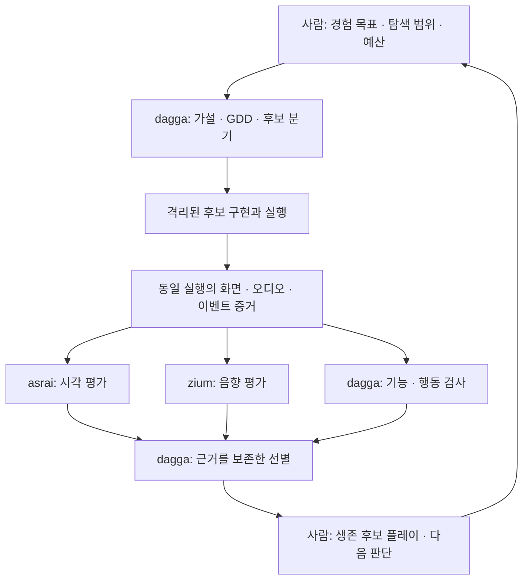

# asrai · zium · dagga: 세 축 운영 전망

> 작성일: 2026-09-13. 대상: 패키지 작성자이자 게임 디자이너.
> 성격: 현재 구현을 확인한 전망 검토. 아래의 권고는 설계 제안이며, 기존 spec의 개정이나 구현 승인이 아니다.
> 범위: 이 보고서 한 파일만 추가한다. 기존 코드·설정·문서·코퍼스는 수정하지 않는다.
> 표기: **확인**은 현재 파일 또는 이번 실행에서 확인한 사실, **설계**는 명세에 있지만 아직 구현되지 않은 내용, **가설/제안**은 검증을 기다리는 전망이다.

검토 질문은 세 이름으로 기능을 나눌 수 있는가를 넘어선다. **표현에 대한 판단을 재사용하는 현재 asrai의 의도를 유지하면서, 소리와 플레이 가능한 후보의 탐색까지 확장했을 때 사람의 설계 시간이 더 가치 있게 쓰이는가**를 검토한다. 사실·직감·위험·기회·대안·종합의 여섯 관점으로 나누었다.

## 1. 사실: 현재 무엇을 만들고 있는가

### 1.1 읽은 순서와 근거의 우선순위

현재 [README](../../README.md), [패키지 선언](../../pyproject.toml), [spec](../spec.md), 실제 `src/asrai/` 코어·CLI·MCP·테스트를 먼저 확인했다. 이어 [bundled skill](../../src/asrai/data/skill/SKILL.md), [stock 설명](../../src/asrai/data/stock/README.md)과 로케일 설명, [플레이북](2026-09-13-art-direction-skill-playbook.md), [기존 시나리오 검토](2026-09-13-art-direction-skill-scenario-review.md), [아티스트 안내](2026-09-13-art-direction-artist-brief.md), [CHECKPOINT](../CHECKPOINT.md)를 대조했다.

현재 의도는 spec으로 읽고, 현재 능력은 코드와 실행으로 판단했다. 기존 검토의 3D 제외·약 305개 어휘·MCP 후순위 도입은 이후 개정으로 대체되었다. 지금은 **475개 어휘를 유지하고, 3D는 렌더된 뷰를 통해 다루도록 설계하며, MCP는 처음부터 제공**한다. 기존 검토에 적힌 경쟁 제품의 부재나 API 가격은 이번 전망의 확정 근거로 재사용하지 않았다.

### 1.2 구조와 실행 흐름

| 위치 | 현재 책임 | 확장 전망에 중요한 점 |
|---|---|---|
| `src/asrai/cli.py`, `server.py` | 같은 코어를 호출하는 CLI와 stdio MCP | MCP가 판단 엔진 자체는 아니다. 다른 실행자가 같은 코어를 사용할 수 있다 |
| `vocab.py`, `data/stock/` | 용어 검색·정량화 조건·조작 의미·부분 lint | 지각 목표와 조작 가능한 수치를 구별하는 기반이다 |
| `measure.py` | Pillow·numpy로 래스터의 휘도·채도·팔레트·알파·실루엣 등을 측정 | 입력을 쓰지 않는 측정 기능이 실제 존재한다 |
| `records.py` | observation·pairwise·instruction 검증 후 JSONL append | 관찰과 판단 이력을 보존하는 출발점이다 |
| `config.py`, `doctor.py` | 로컬 설정, 환경 버전과 lock drift 보고 | 재현성의 일부가 구현되어 있다. strict 실행 거부는 아직 설계다 |
| `data/skill/SKILL.md` | 호스트 모델이 도구를 쓰는 순서와 판단 규율 | 관찰의 주체는 호스트 모델이다. 서버에 자율 AD 모델이 내장된 것은 아니다 |
| `tests/test_asrai.py`, `tools/validate_stock.py` | 코어·MCP smoke test, 어휘·예제 검증 | 구현 검증과 인간 판단에 대한 효과 검증의 범위가 다르다 |

현재 경로는 `호스트 → CLI/MCP → vocab/measure/lint/records/doctor`다. 원하는 전체 경로인 **측정 → qualified 관찰 → 선례 검색 → 레시피 미리보기** 중, 선례 검색과 레시피 실행은 아직 없다. `record`는 호스트가 제출한 관찰을 검사·저장하며 이미지를 대신 보지 않는다. [코드: server](../../src/asrai/server.py), [records](../../src/asrai/records.py).

### 1.3 패키지의 의도

asrai는 인간 AD/TA의 판단을 **기록 가능하고, 검색 가능하고, 저렴하게 다시 적용 가능한 형태**로 만드는 도구다. 생성·인페인트·재묘사, 절대 미학 점수, 팀의 기준 자동 교체는 명시적 non-goal이다. 모델링·리깅·애니메이션 판단도 제외된다. [spec §1–2](../spec.md).

따라서 재사용할 핵심은 이미지 처리 코드보다 다음 판단 계약이다.

- 관찰은 방향을 제안할 수 있지만, 변경량에는 측정·승인된 선례·사람의 근거가 필요하다. **측정값이 존재하는 것만으로 목표값까지 정해지는 것은 아니다.**
- `unknown`은 변경으로 바뀌지 않는다. 단일 에셋, 합성 화면, 다른 렌더 조건의 증거를 서로 바꿔 쓰지 않는다.
- `direction_compliance`, `asset_cohesion`, `intentional_contrast`는 합산하지 않는다. 서로 다르게 보이는 것이 의도일 수 있다.
- 원본과 이력을 보존하고, 사람의 canonical 승격과 파생 인덱스를 구별한다. 다만 승격·검색·인덱스는 현재 **설계**다.

이 계약은 zium에도 의미가 있다. 반면 dagga의 가설 생성·GDD 작성·구현은 현재 asrai의 목적 밖에 있다. 세 축 구상은 **기존 패키지의 단순 분할보다 제품군으로의 확장**에 해당한다.

### 1.4 이번에 확인한 능력과 한계

| 확인 대상 | 이번 근거 | 정당화할 수 있는 판단 |
|---|---|---|
| 기존 테스트 | `7 passed in 1.21s` | 생성 이미지 측정, 일부 lint·기록 규칙, lock drift, MCP 도구 조회·호출이 해당 테스트에서 통과했다 |
| stock 검증 | 475 entries, 22 categories, 수치 예제 8건·거절 예제 9건, JSON Schema 통과 | 현재 코퍼스의 기계적 정합성이 확인되었다. 업계 표준성·번역의 전문성까지 증명하지 않는다 |
| 서버 도구 | `vocab_search`, `vocab_get`, `measure`, `record`, `lint`, `doctor` | 실제 노출 도구는 여섯 개다 |
| 시간 표현 | 어휘에 `motion.timing`, `motion.anticipation`, `rig_animation.emotional_beat` 존재 | 시간 관련 용어가 있다. 영상·게임 이벤트를 관찰하는 기능이 있다는 뜻은 아니다 |
| 오디오 | 현재 stock에 audio/sound/music 범주 없음. measure는 이미지 경로 | zium의 오디오 기능·전문 코퍼스는 새 작업이다 |
| 효과와 완성도 | 실제 게임 배치·사람 평가·지속 운영 자료를 이번에 확인하지 못함 | AD의 시간 절감, 좋은 후보의 보존율, zium/dagga의 E2E 성공률은 미검증이다 |

자동화에 연결하기 전에 특히 유의할 구현 차이가 있다.

1. `server.lint({})`가 `{"valid": true, "errors": []}`를 반환한다. 현재 lint는 대표적인 의미 오류를 잡는 부분 검사이며 완전한 요청 검증기나 실행 승인 게이트가 아니다. 함수 설명도 이를 명시한다. [vocab.py 177행부터](../../src/asrai/vocab.py), [server.py 67행부터](../../src/asrai/server.py).
2. spec은 `structural` 용어에 `set`을 금지하지만, 현재 `rig_animation.emotional_beat`의 프로파일은 `set`을 허용하며 해당 요청이 lint를 통과했다. 선언된 일반 규칙과 실제 어휘·검사 사이에 차이가 있다. 이 보고서는 어느 쪽을 새 정답으로 채택하지 않는다.
3. `order_checked: true`는 제출된 불리언을 검사한다. 실제 A/B·B/A 실행 증거를 검증하는 것은 아니다. `records.append`에도 다중 writer·중단 복구를 위한 명시적 프로토콜은 없다. [records.py 98–129행](../../src/asrai/records.py).

이것들은 현재 도구가 쓸모없다는 뜻이 아니다. **기록·보조 검사 도구를 무인 후보 공장의 신뢰 경계로 곧바로 사용할 수 있다는 증거가 없다는 뜻**이다. 코드 수정은 하지 않았다.

### 1.5 외부에서 확인한 관련 사실

- FFmpeg는 시간 영역 통계와 loudness 측정을 제공한다. `ebur128`은 momentary·short-term·integrated loudness와 LRA를 구분한다. 따라서 측정 부품을 zium이 전부 새로 구현해야 하는 상황은 아니다. [FFmpeg astats](https://ffmpeg.org/ffmpeg-filters.html#astats), [ebur128](https://ffmpeg.org/ffmpeg-filters.html#ebur128).
- Unity Audio Mixer에는 bus 처리·snapshot 전환·ducking이 있고, snapshot들을 가중 혼합하는 API도 있다. 소리의 상태별 실행 표면 역시 기존 엔진에 존재한다. 이것은 현재 asrai와 연결되어 있다는 증거는 아니다. [Unity Audio Mixer](https://docs.unity3d.com/Manual/AudioMixer.html), [TransitionToSnapshots](https://docs.unity3d.com/ScriptReference/Audio.AudioMixer.TransitionToSnapshots.html).
- 2026년 BASS 논문은 평가한 오디오 언어 모델들이 음악의 구조 분할 등 상위 추론에서 어려움을 보였다고 보고한다. 이 결과는 해당 평가의 범위이며, 모든 최신 모델이나 게임 사운드에 대한 보편 판정은 아니다. [BASS, 저자 초록](https://arxiv.org/abs/2602.04085).
- PCGML 문헌은 레벨·맵 같은 기능적 콘텐츠와 스프라이트·효과음 같은 표현 콘텐츠를 구별한다. MAP-Elites는 사용자가 정한 변이 축에 걸쳐 다양한 우수 해를 보존하는 탐색 방법이다. 어느 문헌도 이 repo의 세 축 운영이나 인간의 재미 판정을 검증하지 않는다. [PCGML](https://arxiv.org/abs/1702.00539), [MAP-Elites](https://arxiv.org/abs/1504.04909).

## 2. 직감: 이름과 제품으로 받는 인상

- **asrai**는 흐릿한 의도를 눈으로 확인할 수 있게 하는 도구라는 인상이 든다.
- **zium**은 소리의 의도와 맥락을 알아듣는 동료라는 인상이 든다. Art Direction과 Sound Direction의 짝도 자연스럽다.
- **dagga**는 후보를 날카롭게 가려내는 이름으로 기억된다. 동시에 “대가”라는 이름은 산출물의 수준에 대한 기대를 크게 만든다.
- 세 이름을 묶었을 때, 표현을 다듬는 두 전문가와 실험을 이끄는 하나의 디렉터가 떠오른다.

이 절은 사용자에게서 받은 어원 설정에 대한 주관적 인상이다. 명칭의 시장성이나 이름 사용 가능성을 조사한 결과는 아니다.

## 3. 비판: 어디서 전망이 무너지는가

| 위험 | 실패가 일어나는 방식 | 처음 관찰될 징후 |
|---|---|---|
| 세 축의 책임을 대칭으로 취급 | dagga의 생성·실행·예산 책임과 asrai/zium의 전문 평가 책임이 섞인다 | 같은 후보를 누가 탈락시켰는지, 평가 기준을 누가 바꿨는지 불분명하다 |
| 정지 이미지의 범위를 넘어선 판정 | 실루엣·색 분석을 hitstop, 반응성, 동작 가독성의 검증으로 받아들인다 | 스크린샷은 좋지만 실제 조작에서 피드백이 늦거나 가려진다 |
| DSP 수치가 청취 판단을 대신함 | spectrum·loudness의 유사성을 음색 적합성·긴장·감동의 동일성으로 해석한다 | 측정은 개선되는데 믹스 안의 cue를 구분하기 어려워진다 |
| 생성자와 평가자의 자기확증 | GDD·후보·평가 설명을 같은 모델이 만들고 자기 설명에 맞는 결과를 우대한다 | 루브릭 점수는 오르지만 사람이 계속 개발할 후보의 비율은 오르지 않는다 |
| 생존작만으로 선별기를 평가 | 탈락한 좋은 후보를 관찰하지 못한다 | “사람에게 보여 주는 수가 줄었다” 외에 좋은 후보를 보존했다는 근거가 없다 |
| polish가 가설을 바꿈 | 화면 흔들림·시간 정지·음악 고조가 입력, 위험 인지, 목표 선택까지 바꾼다 | 원래 메커니즘과 무엇이 재미를 만든 것인지 구별되지 않는다 |
| 선례의 자기증식 | 모델의 pass가 인간 승인 사례로 재사용된다 | 사람 피드백 없이도 시스템의 확신과 canonical이 계속 증가한다 |
| 무인 실행의 비용과 상태 관리 | 실패한 빌드·재시도·캡처·리뷰가 중첩되고 로그가 부분적으로 남는다 | 산출 후보 수보다 재시도와 미완료 실행의 수가 빠르게 늘어난다 |
| 콜드 스타트의 전문성 부족 | 아트 사전을 소리 사전으로 치환하거나 일반 휴리스틱을 팀 기준으로 간주한다 | 팀이 의도한 거칠음·침묵·불협화음·이질감을 반복적으로 교정한다 |

가장 큰 불확실성은 **asrai와 zium의 통과가 게임의 가능성을 얼마나 예측하는가**다. 두 축의 일치 여부는 표현의 일관성을 설명할 수 있다. 그것만으로 선택의 깊이, 통제감, 학습의 재미, 다시 플레이하고 싶은 이유가 설명되지는 않는다.

또한 현재 asrai의 “GPU 없는 팀”이라는 목표를 dagga 전체의 저비용 약속으로 확장할 근거는 없다. 생성·엔진 빌드·실행·오디오 렌더·모델 관찰은 서로 다른 비용을 갖고, 후보와 반복 횟수가 늘면 각각 누적된다.

## 4. 낙관: 성공하면 무엇이 남는가

| 축 | 독립적으로 제공할 수 있는 가치 가설 | 세 축을 함께 쓸 때의 가치 가설 |
|---|---|---|
| asrai | “왜 이 수정이 필요한가”와 승인된 시각 언어를 재사용 | 후보마다 아트 기준을 다시 설명하는 비용 감소 |
| zium | 효과음·음악·믹스에서 문제 구간과 변경 근거를 연결 | 플레이 이벤트와 소리의 대응을 후보 간 비교 가능 |
| dagga | 원시 아이디어를 서로 구별되는 플레이 가능한 실험으로 전환 | 사람이 문서나 실패한 빌드 대신 실제 선택지에 시간을 사용 |

이 조합의 자산은 생성량보다 **가설 → 구체적 구현 → 실제 실행 증거 → 인간의 결정**이 연결된 사례가 될 수 있다. 같은 “타격감이 약하다”도 어떤 상황에서 시각 신호, 소리, 입력 결과 중 무엇이 원인이었는지 남길 수 있다.

asrai와 zium은 각각 수작업 프로젝트에도 쓸 수 있는 독립 가치를 가질 수 있다. dagga가 아직 불안정해도 두 전문 도구의 성과를 따로 측정할 수 있다는 점은 제품군의 전망에 유리하다. 다만 실제 사용 빈도·재사용률·지불 의사는 아직 확인되지 않았다.

## 5. 창의: 고려할 수 있는 운영 형태

- **세 전문 역할, 같은 실험 묶음:** 동일 build·playthrough에서 나온 화면·오디오·이벤트를 각 역할이 다른 관점으로 읽는다.
- **후보 지도:** 하나의 순위를 만드는 대신 위험/보상 구조, 입력 방식, 정보 공개 방식 등 설계상 다른 구획에 후보를 남긴다.
- **변경을 뺀 비교본:** 최종 polish 버전과 함께 해당 효과를 제거한 버전을 남겨, 어떤 변화가 경험을 만들었는지 비교한다.
- **미결정이 살아 있는 GDD:** 미정 항목을 문서에서 지우지 않고, 그 항목을 구별하는 실험과 후보에 연결한다.
- **청취를 위한 재현 장면:** 효과음 파일 하나의 리뷰 외에, 같은 전투·전환·반복 상태를 재생하는 작은 사운드 검토 장면을 갖는다.

## 6. 종합: 권고하는 분리와 도입 조건

**세 축 운영은 유망하다. 책임은 asrai·zium을 독립적인 전문 디렉팅 도구로, dagga를 이들을 사용하는 후보 탐색 운영자로 두는 편이 현재 의도와 잘 맞는다. 지금 세 개의 완성 MCP 제품으로 분리 출시할 준비가 되었다는 근거는 없다. 특히 dagga의 가치는 자동 생성보다 좋은 가능성을 보존하면서 인간의 플레이 비용을 줄이는지에 달려 있다.**

### 6.1 책임과 의존 방향

| 주체 | 소유할 결정과 실행 | 입력 → 출력 | 판정의 상한 |
|---|---|---|---|
| 사람 | 추구할 경험, 허용할 탐색 범위, 예산, 채택·폐기, 팀 기준의 승격 | 의도·레퍼런스·플레이 경험 → 다음 설계 결정 | 무엇을 만들 가치가 있는가 |
| asrai | 시각 증거의 측정·관찰·선례·수정 제안 | 렌더/캡처·시각 방향 → 축별 판단·근거·preview | 제공된 시각 증거와 지원 범위에서의 적합성 |
| zium | 음향 증거의 측정·청취·선례·수정 제안 | 오디오·믹스·이벤트·음향 방향 → 구간별 판단·근거·preview | 제공된 청취 조건과 구간에서의 적합성 |
| dagga | 가설·GDD·후보 분기·구현·실행·검사·예산·선별 | 원시 아이디어 → 비교 가능한 생존 후보와 미결정 | 어떤 후보가 다음 인간 실험에 적합한가 |



위 도식은 제안이다. **게임 동작 검사의 책임은 dagga 내부에 명시적으로 필요하다.** asrai/zium 두 평가를 통과했다는 이유로 실행 가능성이나 메커니즘을 검증한 것으로 간주하지 않는다. 네 번째 브랜드를 추가할 필요는 없다.

의존성은 `dagga → asrai/zium`으로 둔다. asrai나 zium이 dagga의 GDD·빌더에 의존하게 만들면 독립 도구로서의 사용성이 줄어든다. 공통으로 맞출 것은 실행 ID·증거 참조·판단의 출처이고, 사전·시간 단위·처리 알고리즘을 하나로 합칠 필요는 없다.

### 6.2 zium: asrai의 판단 계약을 소리에 맞게 옮긴다

여기서 `render`는 **들어볼 수 있는 오디오 렌더**와 **파형·spectrogram 같은 시각화**를 구별해 해석한다. DSP는 측정과 처리를 맡는다. 둘 중 하나를 고르는 문제가 아니라 다음 경로로 연결하는 문제다.

`오디오/실행 캡처 → DSP 측정 → 실제 오디오와 보조 시각화 관찰 → 구간·상태별 방향 판단 → 근거 있는 변경량 → 재렌더 → 동일 조건 비교`

#### 증거는 공간 대신 시간·믹스·상태를 포함해야 한다

| zium에 제안하는 증거 단위 | 알 수 있는 것 | 그 단위만으로는 정당화할 수 없는 것 |
|---|---|---|
| 소스 구조: MIDI, routing, cue 목록, loop marker | 구성과 연결 관계 | 실제 음색, 청취 가능한 균형 |
| 단일 cue 또는 stem의 렌더 | 길이, envelope, 스펙트럼, 피크, 개별 음색에 대한 관찰 | 실제 게임 믹스 안에서 잘 들리는지 |
| 동기화된 scene mix와 stem | cue와 음악·환경음의 겹침, 특정 순간의 우선순위 | 다른 상태·플레이 경로에서도 같은지 |
| 상태 전환을 포함한 시간적 실행 기록 | 전투 진입·이탈, 반복·중단·재진입에서의 변화 | 플레이어가 실제로 긴장하거나 감동하는지 |

마지막 행은 asrai의 현재 L2 정지 프레임 계약보다 넓다. **새로운 오디오/시간 증거 계약의 제안**이며, 현재 `records.py`에 존재하는 L3나 오디오 지원을 뜻하지 않는다. asrai의 `1.0/target/64` 배율을 소리에 기계적으로 대응시키지 않는다. 소리에서는 사건의 attack 구간, cue 전체, 여러 사건을 포함한 장면처럼 질문에 맞는 시간 창이 필요하다.

#### dynamics·spectrum·emotional arc의 취급

| 관심 축 | 측정 가능한 근거의 예 | 디렉팅 판단 | 필요한 추가 증거 |
|---|---|---|---|
| dynamics | 구간별 loudness, peak, envelope, crest factor | “충격의 대비가 약하다”, “반복 시 피곤하다” | 비교 기준, 사건 구간, 반복 청취 |
| spectrum | 구간·채널별 대역 에너지, spectral centroid 등의 특징 | “cue가 음악에 묻힌다”, “역할에 비해 날카롭다” | stem과 최종 믹스, 목표 재생 조건, 실제 청취 |
| emotional arc | 이벤트 순서, 밀도 변화, 편성·템포·화성 변화의 관찰 | “예고→긴장→해소가 의도대로 전달된다” | 장면 목표, 상태 경로, 충분한 길이의 청취와 인간 판단 |

세 행은 합산 점수가 아니다. 스펙트럼 겹침은 masking을 조사할 이유가 될 수 있지만 그것만으로 청각적 masking이 입증되지는 않는다. loudness 곡선이 커지는 것을 emotional arc의 성공으로 정의해서도 안 된다. BASS의 구조 추론 결과를 고려하면, 모델의 자신감보다 해당 프로젝트의 청취 과제에서 보정한 일치도를 확인해야 한다는 것이 이 보고서의 추론이다. [BASS](https://arxiv.org/abs/2602.04085).

파형·spectrogram은 문제의 위치를 표시하는 보조 증거로 유용하다. 시각화를 읽었다는 사실만으로 “들었다”고 기록하지 않는다. 호스트에 실제 오디오 입력 능력이 없다면 청취 판단은 `unknown` 또는 `unavailable`이며, DSP 측정 결과만 반환하는 경로도 독립적으로 유효하다. 네 호스트에서의 오디오 전달·입력 지원과 관찰 비용은 아직 검증되지 않았다.

#### 실행 표면과 불변식

처음에는 기존 DSP·엔진 mixer를 실행 표면으로 사용하고 zium은 **어디를 왜 바꾸는지와 재검토**를 소유하는 편이 적절하다. FFmpeg의 측정이나 Unity의 mixer 기능이 그 출발점을 제공한다. 특정 엔진 채택을 권고하거나 현재 연결을 확인한 것은 아니다. [FFmpeg](https://ffmpeg.org/ffmpeg-filters.html#ebur128), [Unity Audio Mixer](https://docs.unity3d.com/Manual/AudioMixer.html).

- 원본 오디오를 보존하고, 렌더·DSP chain·도구 버전·입출력 hash를 기록한다. 난수 변형은 seed와 선택 결과를 남긴다.
- gain과 EQ, 시간 편집, pitch/tempo 변경, stem 추가를 구별한다. 작업 종류별로 길이·동기·loop 경계·채널 배치 중 무엇을 보존하는지 선언한다. asrai의 알파 규칙을 그대로 복사하지 않는다.
- sample rate, channel layout, sample/frame/time 단위와 시간 원점을 명시한다. 측정의 재현성과 엔진·플러그인 렌더의 재현성은 따로 검증한다.
- 음색 비교에는 loudness를 맞춘 청취본이 도움이 된다. 믹스의 실제 균형·dynamics 검토에는 원래 gain 관계를 보존한 버전도 필요하다. 모든 비교본을 자동 정규화하면 검토할 차이를 지울 수 있다.
- 추가 레이어는 gain 교정과 다른 창작 변경이다. cue의 역할, 들어오는 조건, 빠지는 조건, 동시 발음 범위, 반복·전환의 동작을 함께 검토한다. 원본 믹스만 보고 빠진 stem을 추정해 확정하지 않는다.

“더 웅장하게”를 곧바로 EQ 수치나 레이어 개수로 바꾸는 시스템보다, 승인된 음향 목표와 실제 구간을 연결하는 시스템으로서 전망이 더 좋다.

### 6.3 dagga: GDD는 실험을 연결하는 문서여야 한다

사용자가 제안한 흐름은 다음과 같이 구체화할 수 있다. 아래 항목은 구현된 dagga 기능이 아니다.

| 단계 | 남길 최소 산출물 | 다음 단계에 갈 근거 |
|---|---|---|
| primitive idea/hypothesis | 원하는 경험, 가설, 반증될 상황 | 무엇이 다르면 이 아이디어를 재고할지 설명 가능 |
| GDD | core loop, 입력·결과·위험/보상, 최소 표현, 비목표 | 가설을 실제 행동으로 옮길 수 있음 |
| candidate shape + open decision probes | 미결정별 대안, 구별할 관찰, 책임자, 임시 가정 | 후보 간 차이가 이름·문구 이상의 실험 차이를 가짐 |
| implement | 격리된 build, 변경 내역, 생성/구현 입력 참조 | 시작·입력·결과를 재현할 수 있음 |
| 기능·행동 검사 | 실행·입력 기록, 진행/실패/재시작 증거, 성능 | 후보의 가설을 시험할 최소 게임 동작이 존재 |
| asrai/zium 검토 | 같은 실행에 대한 시각·음향 근거와 불확실성 | 지원되는 범위에서 표현의 결함과 의도가 구분됨 |
| 제한된 polish | 원본·변경본, 변경 근거, 재실행 결과 | 원래 가설을 보존했는지 또는 새 가설이 됐는지 확인 |
| 선별 → 인간 플레이 | build, 짧은 안내, 미결정, 생존 근거 | 사람이 무엇을 경험하고 어떤 결정을 내려야 하는지 명확 |

**미결정은 모델이 문장을 매끄럽게 만들기 위해 임의로 닫아서는 안 된다.** 선택지가 중요한 행동 차이를 만들고 승인된 탐색 범위 안이면 후보로 분기한다. 플레이로만 알 수 있는 것은 인간 세션까지 남긴다. 예산·권한·데이터·핵심 목표를 바꾸는 결정은 소유자의 결정이 필요하다.

예를 들어 “돌진 뒤 다음 표적을 고르는 판단이 재미있는가”라는 가설에서, 자동 표적 지정과 플레이어 방향 입력은 서로 다른 후보가 된다. GDD에는 이 차이를 남기고, 테스트는 입력에 따라 표적과 결과가 실제로 달라지는지 확인한다. asrai는 그 장면의 표적 표시를, zium은 표적/적중 cue를 검토할 수 있다. **선택의 재미와 통제감에 대한 답은 생존 후보를 플레이하는 디자이너에게 남는다.**

자동 플레이도 주어진 과제에 대한 증거다. Unity ML-Agents의 학습은 설정된 보상을 최적화한다. 여기서 “보상 달성은 재미의 증명이 아니다”라는 결론은 목적 함수와 인간 경험을 구별한 추론이다. 처음부터 RL을 요구할 이유는 없으며, 고정 입력 replay·스크립트 봇·상태 전이 검사가 질문에 충분하면 그것부터 쓰면 된다. [Unity ML-Agents: Agents/Rewards](https://unity-technologies.github.io/ml-agents/Learning-Environment-Design-Agents/#rewards).

### 6.4 선별: 통과의 뜻을 작게 유지한다

세 제품명과 별개로, 후보의 평가 항목도 분리되어야 한다.

| 판정 | 자동화할 수 있는 범위 | 선별에서의 의미 |
|---|---|---|
| 기능 적합성 | 빌드·시작·입력·진행·종료·재시작, 정의된 성능 조건 | 가설을 플레이로 시험할 수 있는가 |
| 표현 적합성 | asrai/zium이 지원하고 캡처가 있는 조건 | 방향과 명백한 표현 결함을 구분할 수 있는가 |
| 실험 가치 | 후보가 미결정을 구별하는가, 다른 후보와 행동상 다른가 | 사람의 제한된 세션에 올릴 이유가 있는가 |
| 경험적 가치 | 통제감, 흥미, 몰입, 다시 시도할 이유 | 최종적으로 인간 플레이가 필요한 질문 |

`unknown`은 자동 fail도 pass도 아니다. 필수 증거가 없어 실행 안전성·테스트 가능성을 판정할 수 없으면 보류한다. 표현의 불확실성은 확인된 사실과 함께 남기고, 승인된 탐색 정책에 따라 다음 평가에 보낼 수 있다. 이를 수정량으로 바꾸거나 확신 있는 선례로 승격하지 않는다.

하나의 종합 점수로 모든 후보를 정렬하기보다, **설계상 다른 후보를 보존하는 탐색**이 dagga의 목적에 더 맞는다. MAP-Elites의 다양한 해를 보존하는 원리는 참고할 수 있다. 초기에는 설계자가 정한 몇 개의 구획과 중복 제거로 시험할 수 있고, 전용 탐색 알고리즘 채택은 별도 판단이다. [MAP-Elites](https://arxiv.org/abs/1504.04909).

“살아남은 후보만 사람이 플레이한다”는 생산 운영의 목표로 유지할 수 있다. 그러나 **탈락 후보의 인간 판정이 전혀 없으면 좋은 후보의 오탈락률은 알 수 없다.** 선택지는 명시해야 한다.

- 원안을 엄격히 유지: 이미 사람이 평가한 별도 검증셋에서 선별기를 보정한다. 새로운 후보 분포에서의 오탈락은 계속 미검증으로 표시한다.
- 검증 기간에 한정한 변경 제안: 탈락 후보의 일부를 별도로 블라인드 평가해 누락을 추정한다. 이는 원안에 대한 예외 제안이며, 승인 없이 “감사 생존작” 등으로 이름을 바꿔 우회하지 않는다.

생존작의 평균 품질 상승만으로 두 번째 문제까지 해결되었다고 말할 수 없다. 이 선택은 아래의 열린 프로브로 남긴다.

### 6.5 juice 자동화: 표현 변화와 규칙 변화를 구별한다

| 변경 예 | 책임 | 필요한 비교와 경계 |
|---|---|---|
| 색·값·팔레트 조정 | asrai의 향후 recipe | 같은 장면에서 전후 비교. 현재 alpha·수량 근거 계약 준수 |
| cue gain·EQ·ducking·믹스 전환 | zium의 향후 recipe + 엔진 실행 | 단일 파일뿐 아니라 해당 사건의 믹스와 반복·전환 재검토 |
| 타격음 stem·시각 효과 추가 | dagga가 후보 변경을 조정하고 전문 도구가 평가 | 제거한 비교본을 남겨 추가 효과가 무엇을 바꿨는지 확인 |
| hitstop·recoil·입력 buffer·animation timing·camera shake | dagga의 게임 실행 책임 | 입력 결과·게임 시간·조준·위험 인지가 달라질 수 있으므로 메커니즘 검사를 다시 수행 |

현재 asrai는 마지막 행의 동작 판단을 지원하지 않는다. 관련 어휘가 있다는 이유로 애니메이션 판단의 non-goal이 해제되는 것도 아니다. 시간적 시각 검토가 필요하면 그 범위를 향후 명시적으로 재설계해야 한다.

권고하는 자동 polish는 **선언된 범위 안의 제한된 변형 → 같은 조건의 실행 → 축별 비교 → 보존/반려**다. 개선이 불명확하거나 반복·예산 한도에 도달하면 멈춘다. 평가자에게 제작자의 “왜 좋아졌는가” 설명을 먼저 주지 않고, 가능하면 조건명을 가린 비교와 보류된 실행 장면을 사용한다. 평가 역할을 분리해도 모델의 오류가 독립이 된다고 가정하지 않는다.

기본 순서는 core loop의 검증 후 비용이 큰 polish다. 다만 리듬·공포·음향 단서처럼 표현 자체가 가설인 경우에는 최소한의 소리와 타이밍이 첫 후보부터 있어야 한다. 모든 장르를 무음 회색 상자로 먼저 선별하는 규칙은 적합하지 않다.

**승인 경계는 중요한 선행조건이다.** 현재 asrai는 `magnitude_basis: llm`의 적용과 alpha 변경의 자동 적용을 허용하지 않는다. dagga가 모델 수치를 `human`으로 다시 표기해 넘겨서는 안 된다. 사람/선례가 실제로 정한 값이나 근거 있는 계산을 사용하고, 미리 승인된 실험 범위를 운영하려면 대상·레시피·파라미터·출력 위치를 실행 시 검증하는 별도 계약이 필요하다. 원래 금지된 자동 적용은 spec 개정 없이 허용되지 않는다. [spec §2, §8](../spec.md).

### 6.6 공통으로 맞출 것은 증거와 실행 경계다

최초의 공통 산출물은 새 프레임워크보다 **후보 실행 폴더와 작은 manifest**면 충분하다. 기존 capture contract를 참고하되, 오디오와 이벤트를 연결할 다음 정보를 제안한다.

| 정보 | 필요한 이유 |
|---|---|
| candidate ID, 가설/GDD/probe revision, build hash | 다른 가설이나 다른 빌드의 평가가 섞이지 않게 함 |
| seed, replay 입력, 엔진·렌더·DSP·모델/prompt 버전 | 변형과 실행 조건을 다시 확인할 수 있게 함 |
| 화면·오디오·stem·이벤트 artifact hash와 구간 참조 | 판단을 실제 증거로 되짚을 수 있게 함 |
| 시간 원점, 영상 frame/time, 오디오 sample/time의 대응 | hitstop·pause·전환에서 서로 다른 시계를 혼동하지 않게 함 |
| 평가 축, qualified level, 변경의 근거, 승인 참조 | 관찰·판단·실행 권한을 구별함 |
| 비용, 반복 횟수, 종료 상태, 중단 원인 | 실패와 비용을 포함해 후보의 실제 생산성을 계산함 |

교차 평가에서는 사건을 공유한다. 예를 들어 공격의 예고·접촉·해소 시점에서 asrai의 화면 증거와 zium의 소리 증거를 함께 본다. 둘이 각각 좋은 결과를 냈어도 중요한 cue가 동시에 과밀해졌는지는 별도 질문이다. 개별 평가의 합산으로 자동 해결되지 않는다.

dagga의 병렬 생성량에 맞춰 기록 저장을 검증해야 한다. 처음에는 실행별 파일과 한 명의 집계 writer로 소유권을 정할 수 있다. 동시 업데이트·쿼리가 실제로 필요해지면 SQLite 같은 기존 수단을 검토한다. 현재 JSONL append를 근거 없이 다중 writer 저장소로 간주하지 않는다.

자동 생성한 코드의 실행은 지정된 작업공간·도구·네트워크·시간/비용 한도 안에서 이루어져야 한다. 승인 주체는 실행기이며, 생성된 GDD나 도구 응답 안의 `authorized: true` 문장은 권한을 만들지 않는다. 중단 뒤 재실행에서는 같은 작업의 중복 비용·중복 기록을 구별할 수 있어야 한다. 이 경계가 없으면 무인 farming 단계로 넘어갈 근거가 없다.

### 6.7 배포와 운영: 역할 분리부터 검증한다

| 선택 | 얻는 것 | 추가로 소유하게 되는 비용 | 현재 판단 |
|---|---|---|---|
| asrai를 그대로 쓰며 외부에서 zium/dagga 실험 | 현재 사용자 경로를 유지하고 역할별 유효성을 관찰 | 실험 간 연결 방식 | 초기 검증에 적합 |
| 같은 repo 안에 독립 실행 단위를 추가 | 공통 fixture·증거 형식의 변경을 함께 검토 | 도메인 경계와 의존성 관리 | 실제 두 번째 구현이 생길 때 검토 |
| 독립 패키지·MCP 세 개 | 선택 설치, 서로 다른 의존성과 출시 주기 | 버전 호환·배포·호스트별 설치·지원 조합 | 독립 사용자가 생기거나 배포 요구가 갈릴 때 타당 |

브랜드·책임·배포 단위를 같은 시점에 세 등분할 필요는 없다. 현 구조의 장점인 **CLI/MCP가 같은 코어를 호출하는 방식**을 유지하면, dagga의 배치 실행이 매번 MCP를 통해 자기 자신을 호출할 필요도 없다.

asrai의 도구 수 상한은 그대로 존중한다. 세 제품을 붙이면서 모든 도구를 한 호스트에 항상 노출하는 방식의 비용은 실제 호스트에서 확인해야 한다. 장시간 후보 생성의 재시도·중단·예산은 실행 작업의 상태로 관리하고, MCP 호출은 그 작업을 요청하거나 결과를 조회하는 접점으로 둘 수 있다. 이 또한 현재 구현은 아니다.

공통 코어 추출의 시점은 두 도메인에 실제로 같은 의미의 코드가 나타날 때다. 지금 오디오의 시간·채널·믹스 개념을 이미지의 bbox·scale 스키마에 넣거나, 아직 없는 세 번째 소비자를 위해 범용 프레임워크를 만드는 것은 설계 근거가 부족하다.

### 6.8 전망을 검증하는 순서와 중단 조건

다음은 일정 약속이 아니라 **증거를 얻는 순서**다. 각 단계는 다른 단계의 전체 로드맵 완성을 요구하지 않는다.

| 단계 | 가장 작은 유효 실험 | 통과 근거 | 중단·재계획 조건 |
|---|---|---|---|
| A. asrai의 작은 폐루프 | 한 팀·한 에셋군에서 측정→관찰→한 종류의 preview→인간 판단 | 실제 문제/근거/변경/전후가 연결되고 원본·필수 불변식 보존. 고정 fixture와 별도 평가 표본 | 일반 규칙과 실제 validator가 충돌하거나, 개선 근거보다 설명만 쌓임 |
| Z. zium의 최소 청취 실험 | 한 사건의 cue와 장면 믹스, 고정된 반복/전환 | DSP 값 재현, 구간 연결, 청취 가능한 전후 비교, 사람의 판단과 비교 | 호스트가 오디오를 받지 못함, 믹스 증거 부재, loudness 증가만을 개선으로 판단 |
| D. dagga의 수동 예산 실험 | 한 엔진·한 종류의 짧은 core loop에서 미결정 하나를 가르는 후보 생성 | 서로 다른 가설의 build가 실제 실행되고, 디자이너가 플레이로 다음 결정을 내림 | 표현 검사 통과가 기능 증거를 대신함, 후보가 행동상 중복됨 |
| P. polish 기여 실험 | 같은 메커니즘의 기본본·polish본·핵심 효과 제거본 비교 | 불변식과 플레이 경험을 나눠 기록하고 변경의 기여를 설명 가능 | 규칙을 바꾼 후보를 같은 메커니즘이라고 비교함 |
| F. 제한된 farming | 승인된 예산과 중단 조건으로 배치 실행 | 총비용·사람 시간·좋은 후보 보존을 기준선과 비교, 중단/재개 동작 확인 | 사람 시간이나 유효 후보당 비용 악화, 오탈락 증거 부재를 해결된 것으로 취급 |

초기 dagga 실험에 asrai의 모든 3D 기능이나 대형 선례 코퍼스가 필요한 것은 아니다. 반대로 앞 단계의 입출력·검증·승인 계약이 없는 상태에서 후보 수부터 키우면 실패 원인을 구별하기 어렵다.

### 6.9 비용과 성과의 판정 기준

**핵심 운영 지표는 “디자이너가 계속 검토할 가치가 있다고 판단한, 서로 다른 후보 한 개를 얻는 총비용”이다.** 생성 수·자동 pass 비율은 보조 지표다. 금액과 사람 시간을 임의의 가중치로 섞지 않고 따로 기록한다.

```text
총 실행비용 = 준비비용
           + 모든 시도의 (생성 + 빌드 + 테스트 + 캡처 + AI 검토 + 수정 + polish 비용)
           + 저장·운영비용

유효 후보당 비용 = 총 실행비용 / 인간이 계속 개발할 가치가 있다고 판단한 후보 수
총 사람 시간 = 목표 설정 + 기준 보정 + 프로브 결정 + 플레이 + 실패 대응 + 선례 승격 시간
```

분모가 0이면 성공 단가를 보고할 수 없다. 실패·중단·재시도 비용도 분자에 포함한다. 실제 모델·장면 길이·반복 횟수의 자료가 없으므로 지금 단가나 손익분기점을 제시할 근거는 없다.

| 평가 항목 | 측정 방법 | 이 항목만으로는 알 수 없는 것 |
|---|---|---|
| 사람의 플레이 효율 | 같은 플레이 시간 안에 얻은 계속 검토할 후보 수 | 탈락시킨 좋은 후보 수 |
| 좋은 후보의 보존 | 인간 판정이 있는 별도 표본에서 선별 결과와 대조 | 새로운 장르·분포에서의 보존율 |
| 표현 검토의 유효성 | 팀의 AD/SD 판단과 축별·구간별 일치, `unknown`의 적절성 | 재미나 시장성 |
| 탐색의 다양성 | 미결정을 다르게 해소하는 행동상의 후보 분포 | 단순한 색·장식 차이 이상의 가치는 인간 검토 필요 |
| polish의 기여 | 같은 가설의 기본본/변경본/제거본 비교 | 여러 요소를 한 번에 바꾼 경우의 개별 원인 |
| 운영 가능성 | 후보당 총비용, 지연 분포, 재시도·수동 복구, 중단/재개 결과 | 장기 수요와 유지율 |

비교 기준은 가능한 한 같은 가설·템플릿·총예산의 수작업 또는 기존 생성 흐름이다. 허용할 비용·누락·시간 변화의 기준은 실험 전에 정한다. 기존 spec의 oracle 수치도 가설이지 dagga의 합격 기준으로 자동 상속할 값이 아니다.

### 6.10 남겨 둘 결정 프로브

| 미결정 | 왜 중요한가 | 결정을 도울 최소 증거 |
|---|---|---|
| 최초 대상이 단일 메커니즘인가, 장르 전체인가 | 생성과 검사의 탐색 공간이 크게 달라짐 | 한 메커니즘의 여러 후보에서 기능 검사와 인간 판단이 연결되는지 |
| “생존작만 플레이”에 검증용 예외를 허용하는가 | 오탈락률을 직접 확인할 수 있는지 결정 | 기존 인간 평가셋의 보존율과 새 분포에서 남는 불확실성 |
| 무인 polish의 사전 승인 범위는 무엇인가 | 현재 asrai의 수량·alpha 계약과 자동화 요구를 동시에 지켜야 함 | 구체적 레시피/대상/수치/출력 범위를 가진 검토 가능한 실험안 |
| zium의 첫 고객 과제가 SFX인가, 믹스인가, 적응형 음악인가 | 필요한 시간 범위·전문 어휘·실행기가 달라짐 | 실제 반복 작업 하나의 입력·문제 구간·담당자 판단 |
| 선택한 호스트에서 실제 오디오 관찰이 가능한가 | 시각화만으로 청취를 대체하는 오류를 방지 | 동일 오디오 과제를 전달·관찰한 실제 실행과 비용 |
| 선례를 승인하는 사람이 누구인가 | 자동 pass가 팀의 취향으로 둔갑하지 않게 함 | 승인된 아트·사운드 예시와 충돌 시 결정 책임 |

이 질문들은 보고서를 작성하기 위한 선행 승인이 아니다. 후속 구현과 무인 운영의 경계를 정할 때 해소해야 할 사항이다.

**종합 결론:** asrai와 zium의 장기 가치는 분야별 판단과 변경의 근거를 축적하는 데 있고, dagga의 가치는 그 능력을 사용해 사람이 실제로 비교할 수 있는 설계 실험을 공급하는 데 있다. asrai의 작은 폐루프, zium의 실제 청취 근거, dagga의 기능·행동 검사와 후보 보존을 각각 증명하면 세 축의 결합을 확대할 이유가 생긴다. 당장의 권고는 역할 분리를 채택하고 작은 실제 후보로 이 연결을 검증하는 것이다. 완전 자동 재미 판정이나 무제한 farming의 전망은 현재 근거로 정당화되지 않는다.

## 부록: 검증의 재현 범위

현재 검토는 미커밋 변경이 있는 로컬 작업트리 기준이다. 조회한 HEAD는 `5ce39a0`이지만, 이 해시만으로 현재 소스의 내용이 고정되지는 않는다. 중요한 입력의 SHA-256은 다음과 같다.

| 입력 | SHA-256 |
|---|---|
| `docs/spec.md` | `8ece7646ff714b6f0657c4bc695b4a299f04b3327e6b64395b80891f860b6f20` |
| `src/asrai/server.py` | `c111e4245de6fd261024482aa33f8419fcfc7ae484ae54adc4dc07bce1af863f` |
| `src/asrai/records.py` | `764b21e7337ccb32d2e62d203c2424b59ecde72c751f1537319e98bda52100fc` |
| `src/asrai/vocab.py` | `3ddf3c2fbeada670eac08bc6a10904f1958dda9c0a57b9a2e6dac8c1aa8c0d84` |
| `src/asrai/measure.py` | `5b42db7525096364a122067665fb6b9018b4973aa23afac7cd832f6ba55d5fa0` |
| `src/asrai/data/stock/vocab.v2.json` | `9a8e8cc54202d241f952abfc248ab0a9e87d4ce2937f8c32ca7319217c28f17c` |
| `tests/test_asrai.py` | `bc7382bfa1086be3bc20b607c15ecfbe12e649c6f51f0388442c80cff3f59177` |

実행한 검증은 다음과 같다. 설치·의존성 갱신·실제 모델 호출·엔진 실행은 하지 않았다. pytest의 산출물은 `/private/tmp`에 두고 bytecode·pytest cache 생성을 비활성화했다.

```bash
PYTHONDONTWRITEBYTECODE=1 PYTEST_DISABLE_PLUGIN_AUTOLOAD=1 PYTHONPATH=src \
  .venv/bin/python -m pytest -q -p no:cacheprovider \
  --basetemp=/private/tmp/asrai-triax-review-pytest-20260913
# 7 passed in 1.21s

PYTHONDONTWRITEBYTECODE=1 .venv/bin/python tools/validate_stock.py
# status: passed; entries: 475; categories: 22
# json_schema: passed_draft_2020_12; numeric_test_count: 8; negative_lint_test_count: 9

PYTHONDONTWRITEBYTECODE=1 PYTHONPATH=src .venv/bin/python - <<'PY'
from asrai.server import lint
print(lint({}))
print(lint({"changes": [{
    "term_id": "rig_animation.emotional_beat", "operation": "set",
    "quantity": {"value": 1, "unit": "s"}, "magnitude_basis": "human"
}]}))
PY
# 두 결과 모두 {'valid': True, 'errors': []}
```

위의 마지막 수치는 현재 lint의 경계를 확인한 입력이며 음향·게임·애니메이션의 권장값이 아니다. 기존 7개 테스트를 통과했다는 사실도 미구현 기능이나 실제 AD/SD/게임 디자인 효과를 검증한 것으로 확장하지 않는다. 외부 문서는 2026-09-13에 본문 또는 명시한 저자 초록을 확인했으며, 인용한 기능·연구 범위를 넘어 제품 전체의 성능 근거로 사용하지 않았다.
