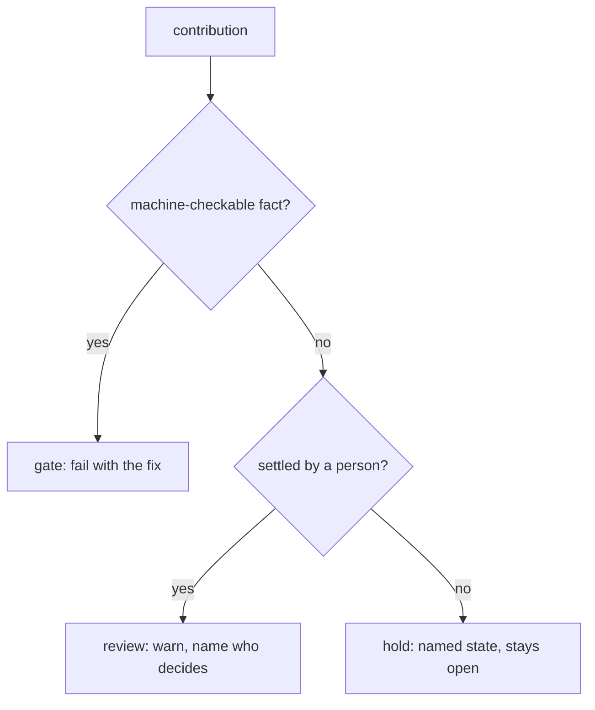

# What a CI gate has to be, when the contributors are not all programmers

**2026-09-15. For the package author, before anything is written into `.github/`.**
Discovery, not a decision: it names the parts, what other projects did with them, what this repository
measures today, and what breaks first. Nothing here supersedes [`spec.md`](../spec.md). The numbers in
it are dated observations of one day, which is why they are not registered in
[`tests/claims.json`](../../tests/claims.json) — a review is never edited, and a claim has to stay true.

## The finding

**The danger is not a gate too strict for artists. It is a gate that is silent about *why* and absent
about *where else* the idea could live.** That failure is invisible for two release cycles and then
reads as disinterest: the vocabulary stops growing, no technical artist has opened a pull request in
six months, and the cause looks like the audience rather than the door.

Three things support that, and they are the three families of precedent worth copying from:

1. **The strictest machine gate over a creative artifact works, and it has been working for a decade.**
   Google Fonts will not publish a font that fails its profile. It is strict about facts and silent
   about beauty, and the type-design community contributes anyway.
2. **The precedents that lost their artists lost them on the reply, not on the standard.** Godot,
   Krita, and the open-source design community all report the same wound, in nearly the same words.
3. **The two closest precedents to what asrai actually is — a controlled vocabulary — gate on
   provenance and name disagreement out loud.** Both rules already exist in this repository under
   different names.

## 1. The parts, and which ones this repository has

| part | what it is | here today |
|---|---|---|
| repository ruleset, required checks | the merge gate itself; rulesets layer, branch protection rules do not | **none.** There is no `.github/` directory |
| merge queue | re-runs checks against the branch as it will be after merge | none; not needed under a handful of open PRs |
| `CODEOWNERS` | who must approve which paths | none |
| pull request template, issue forms | what a contributor is asked before they are read | none |
| DCO or CLA | the right to distribute what was contributed | none; MIT in [`LICENSE`](../../LICENSE) |
| commit convention, generated changelog | machine-written release notes | none; no `CHANGELOG.md` |
| lint and format | `ruff check`, `ruff format --check` | none configured |
| test matrix | OS x Python | none; `requires-python = ">=3.11"` |
| lockfile verification | `uv sync --locked` fails if `uv.lock` drifted | `uv.lock` is committed, so this is available today |
| data integrity | digests over shipped data | `manifest.sha256.json`, checked inside `pytest` |
| number integrity | every count a document states | `tests/claims.json`, checked inside `pytest` |
| link and translation integrity | relative links; translation freshness | `tools/check_links.py`, `tools/check_translations.py`, both by hand |
| environment lock | what was installed when a result was produced | `asrai doctor --lock` writes `asrai.lock.json` |
| publish provenance | who built the wheel on PyPI | none |

Two of those are worth naming now because they are free. `uv sync --locked` turns the committed
lockfile into the pin the build resolves against, which is the general form of the rule that a build
must pin the revision of every artifact it reads. And `doctor --lock` already writes the environment
that produced a measurement; promoting it from a CLI convenience to a checked-in fact is the same move
one level down.

## 2. What worked elsewhere

**Google Fonts / Fontbakery / Fontspector — a machine gate over a creative artifact.** Check results
carry a severity: `ERROR` is a bug in the checker itself, `FAIL` is "a problem with the font that must
be fixed", `WARN` wants human judgment, then `SKIP`, `INFO`, `PASS`. Publication requires the Google
Fonts profile, and the guide's own threshold is that a font "should be at least from Warn level" — so
`FAIL` blocks and `WARN` does not. The second idea is the load-bearing one: **a check's severity
belongs to a profile, not to the check**, because a `FAIL` for the Google Fonts API may be no problem
at all somewhere else. The tool started in 2013 to speed up onboarding and now takes checks from Adobe,
Microsoft, Dalton Maag and independent foundries. A strict gate did not repel the artists; it told them
what "done" meant.

**Getty's Art & Architecture Thesaurus — what a vocabulary asks of a contributor.** The minimum for a
contributed term is the term, its language, **the source of the term**, and a scope note, and
authoritative sources must be cited for everything in the record. Not an argument for the term's
value: a citation. Repository usage, a standard reference, common usage among experts or a community
all count. That is the same rule as invariant 1 here — a magnitude comes from a measurement, a
precedent or a human, never from a model — pointed at vocabulary instead of numbers, and it is a rule a
technical artist can satisfy without writing code.

**Unicode CLDR — where disagreement goes.** Contributions arrive through a survey tool, are vetted by
other contributors rather than accepted on submission, and when votes diverge the item is marked
**Disputed** and moves to a forum. The documentation says plainly that contributors should not expect
their suggestions to simply be adopted. Disagreement is a state the system can be in, not a failure of
the submission. asrai already has this shape: `unknown` is a hold, not a rejection. It does not have it
for pull requests, which today can only be merged or closed.

**Bevy — delegating merge authority before the bottleneck bites.** The project lead wrote that he had
to personally approve every controversial change and that, at 3,642 pull requests and 599 contributors,
"I have long since reached the limits of my bandwidth and the community has felt those limits for long
enough." The fix was Subject Matter Experts: two SME approvals in an area merge a controversial change
without the lead. Worth copying in shape, not yet in size.

**Kubernetes localization — a language needs an owner, not enthusiasm.** Localization teams must be
self-sufficient and keep their content current, and a new localization needs at least two contributors
before it starts. Their own retrospective names the exact problem `tools/check_translations.py` was
written against: there is no easy way in git to see which changes to the original should be revisited
in a translation, so "mostly every translated doc became unsupported from the moment when it was
merged." The stamp fixes the detection. It does not fix the staffing.

**GitHub mechanics worth knowing before writing YAML.** Rulesets layer and branch protection rules do
not, so rulesets are the right primitive. A workflow that is a required check under a merge queue must
also trigger on `merge_group` or it never runs there. Renaming a job renames the required check and
silently blocks merges.

## 3. What failed elsewhere, and it was never the strictness

**Godot, proposal #779.** The complaint is that the process is organised around not implementing
things: the standard reply "you can do this with current nodes and a script" moves the burden back to
the proposer, the process assumes knowledge of the engine's architecture that an ordinary user does not
have, and an idea feels like it must be accepted now or "be rejected forever". The sentence to keep is
that rejection "often comes at the expense of not considering what we *could* reasonably do to help
someone with what they want." Godot's own good answer is in its docs: a rejected feature can often live
as a plugin or a GDExtension. **The route is the remedy, not a softer standard.**

**Krita, the artist-programmer barrier thread.** "Artists don't know what a git repo is." To be heard
on one animation feature an artist had to use Krita, use Linux, download test builds, and already be
doing work involved enough to need lipsyncing. "A massive, overwhelming burden of proof is on us for
making a suggestion... This is a dev-first environment." And the request that costs nothing: that
developers "take the time to reply with a sentence or two."

**Open-source design generally.** Surveys of designers name visibility first — they do not know non-code
contributions are wanted — then GitHub itself as the barrier: issues, pull requests and version control
are second nature to developers and rarely used by designers, and the terminology and review cycles are
unfamiliar enough to deter people who would otherwise help.

**The base rate, from outside this domain.** The most reliable way to discourage contributions is not a
hard standard; it is silence — pull requests left to rot, a reply months later, a submitter who pings
twice and gives up. Strictness with a fast, specific answer is kinder than laxity with no answer.

**The new asymmetry.** A pull request can now be generated in seconds and the cost to review has not
moved. curl ended its bug bounty after AI-generated reports each took hours to validate; Ghostty went
invitation-only. A project that is itself largely agent-written invites this precisely.

**Two gates that decay.** Google measured about 16% of their tests as flaky and 1.5% of test executions
failing incorrectly; a required check that is flaky teaches everyone to re-run red, and after that the
gate is decoration. And conventional-commit changelogs draw the criticism that a commit is too small a
unit to make a useful changelog — this repository's commit messages are already sentences with a reason
in them, and a machine would turn them into something worse.

## 4. The culture gap, stated precisely

The programmer and the technical artist do not disagree about quality. They disagree about **where a
judgment is allowed to live**, and their tools taught them that.

- **Version control.** Artists come from lock-based systems — Perforce is the norm at Epic, Rockstar
  and Ubisoft — because two people cannot merge a texture. Git's model is merge-first, and Git LFS adds
  a learning curve and quotas on top. A workflow built on rebase, squash and text diffs is not neutral;
  it is the programmer's habit made mandatory.
- **Review.** A code review reads a diff. An art review compares two images side by side. Nothing in a
  pull request UI does the second thing.
- **What "no" means.** In code review, "this is wrong" is about the patch. In an art critique it is
  usually about a choice the artist made on purpose. The same sentence lands differently, and the
  `go program it yourself` reply removes even the possibility of answering.

**Where that leaves asrai, which is not a game engine.** Nearly every artist-facing contribution here
is text: a vocabulary term, a locale bundle, a document translation, a surface in `surfaces.v1.json`.
The only binary path is a fixture image, and all six of them together are 60 KB. So the Perforce
problem does not apply and neither does LFS. Two things do:

1. **The toolchain.** `uv sync`, `pytest`, a JSON file edited by hand, a digest to refresh. A term is a
   one-line change that today requires a working Python environment to prove.
2. **The zero-taste rule.** It is the correct invariant and it is the one most likely to read as
   contempt. A technical artist proposing `gritty` is proposing exactly what their job is about, and a
   red test that says the quantification mode is invalid does not tell them that preference has a home
   in this system — their own team's records — and that the door they want is one directory over.

## 5. What this repository measures today

Measured on 2026-09-15 at `cdf7802` plus the working tree.

| measurement | value | why it matters |
|---|---|---|
| CI present | none; no `.github/` | the gate is a person reading a diff |
| authors, all time | 21 commits, 1 | `CODEOWNERS` with one name is a bottleneck, not a control |
| `CHECKPOINT.md` in the last 12 commits | 12 of 12 | any two concurrent pull requests collide here, with near-certainty |
| `spec.md` in the last 12 | 10 of 12 | the contract is a hot file too |
| `manifest.sha256.json` in the last 12 | 7 of 12 | generated content in the merge path |
| files per commit, last 12 | 8.1 mean | "what moves together" is real, and it is also the collision surface |
| suite | 58 tests, 2.5 s wall | CI minutes are not a constraint at any matrix size worth running |
| declared floor | `>=3.11`, and 3.11 passes | checked today; the floor is honest, which a matrix would otherwise discover in public |
| fixture byte-equality | decoder-bound (below) | the most likely first red build on a green change |

**The fixture measurement, in full.** `measure` is asserted byte-equal against six committed
expectations. Its numbers are rounded to four decimals and the tightest of the 304 rounded values sits
9.8e-07 from a rounding boundary, so float arithmetic differences across CPUs or numpy versions — which
land near 1e-16 — cannot move them. Nine orders of margin. **Decoding can.** Perturbing the decode of
`flat.jpg` by ±1 on 0.1% of its subpixels moves 2 of 78 numbers; 1% moves 10; 10% moves 18. The damage
lands on percentiles, which are order statistics: `saturation.p50` jumps a whole quantisation step,
0.5088 to 0.5117. PNG decoding is exact by the format's definition. JPEG's is not: libjpeg-turbo aims
at bit-identical output between its SIMD and C paths but does not achieve it in every case, and does
not claim identity with other libjpeg versions. Pillow is pinned `>=12,<13`, and Pillow bundles the
decoder. **One patch release of a dependency can turn a green change red, in a test whose message says
`measure` drifted.** This is a real defect in the gate, not a hypothetical: it should be fixed before
CI exists, not after it fires. The cheap fix is to assert byte-equality where the format guarantees it
and assert on `flat.jpg` what it is actually there to prove — that a lossy source is reported rather
than corrected.

## 6. Perturbation

Injected the way the surface pass injects into a real frame: things that will actually happen, at
strengths that are ordinary.

| shock | likelihood | what breaks | earliest warning |
|---|---|---|---|
| two pull requests open at once | certain | `CHECKPOINT.md` conflicts; both authors hand-merge a status file | the second PR |
| a Pillow patch release changes the JPEG decode | medium | every pull request goes red, message blames the author's change | a scheduled run on an unpinned environment |
| a generated pull request adding 40 vocabulary terms | medium | validators check shape, not whether the terms mean anything; review cost lands on one person | the first one |
| a technical artist proposes a taste term | high | correct rejection, delivered as a failed assertion with no route | nobody reports this; they leave |
| a translation submitted by someone who cannot read the language | medium | `review_locales` flags loanwords and script only; it already says a clean run is not verification | none exists today |
| a fixture image contributed with no license | medium | permanent contamination of a repository that ships in a wheel | a provenance field that does not exist yet |
| a required check renamed | low | silent merge block | the first person who cannot merge |
| the single maintainer is unavailable for three weeks | certain, eventually | nothing merges; the danluu failure, exactly | none |
| a term correct in English and wrong in one language community | medium | ships in a locale bundle; the bundle README already says a clean flag is not confirmation | a native speaker who has no assigned role |

Two of those deserve their own line because the ordinary answer is wrong.

**The conflict hotspot is caused by a good rule.** "What moves together" travels code, test, skill,
contract and checkpoint in one commit, which is why 8.1 files move per commit and why `CHECKPOINT.md`
is in all twelve. The fix is not to relax the rule. It is that a status snapshot rewritten on every
change is the wrong shape for a file two people edit at once — an append-only log of landed work has
the same content and no conflict, which is the same argument the record corpus already won.

**There is no held state for a contribution.** `unknown` is a hold everywhere in the data model, and a
pull request has no equivalent: merged or closed. CLDR's `Disputed` and Godot's "it can be reopened
later" are the same missing state, and its absence is what turns one rejection into a permanent one.

## 7. What to gate, and what to never gate

**Gate, because a machine can be right about it:** the suite; `uv sync --locked`; manifest digests;
`claims.json`; relative links; translation stamps; `ruff`; the presence of the provenance fields a new
vocabulary term needs; quantification-mode consistency.

**Never gate, because a machine would only be pretending:** whether a term is useful, whether a surface
is worth measuring, whether a translation reads like the industry speaks, whether an idea belongs in
stock at all. Those get a person and, when there is no person, a named hold.

**The rule that makes the difference, borrowed from the failures:** every gate message names where the
thing *can* live. A preference goes to the team corpus, not to stock. A term without a source needs a
citation, not a better argument. A surface that stock will not take is a team's own surfaces file. A
gate that only says no is the Godot #779 failure with better tooling.

## 8. What a human has to decide before `.github/` is written

- **Does a stale translation block a merge?** Recommendation: no — warn, and instead require a named
  owner per language before accepting one, which is the Kubernetes lesson.
- **DCO, CLA, or neither?** Recommendation: DCO. MIT, community-run, no relicensing plan; a CLA's
  signing workflow is friction paid by every typo fix.
- **Conventional commits and a generated `CHANGELOG.md`?** Recommendation: no to generated. A
  hand-written changelog, because the commit messages here are already the sentences a reader wants.
- **Who is the second approver?** Bus factor is 1. Until that is two, `CODEOWNERS` encodes a bottleneck
  and the merge queue has nothing to queue behind.
- **Do contributed fixtures and reference images need a provenance field?** Nothing in the schema
  records where an image came from or under what licence.
- **Is a held pull request a state this project wants?** A label costs nothing and changes what a
  rejection means.
