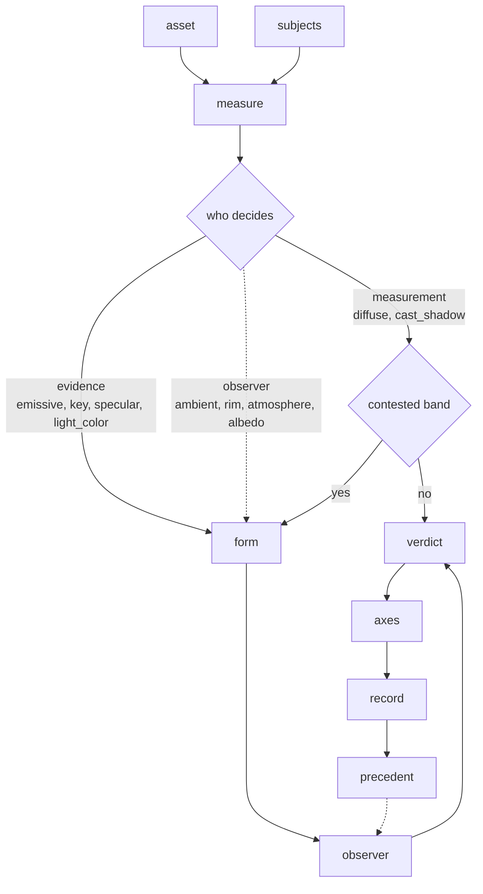

# asrai specification

**Version:** 0.1 (2026-09-13). **Status:** derived implementation contract. Code follows this document;
when they disagree, the code is incorrectly implemented. This specification itself follows the human
decisions and human-maintained documents in [`runbook.md`](runbook.md) §1. An AI-generated spec is an
implementation artifact: it ranks above code for propagation, not above its human source of authority.
Do not amend a governing document merely to match existing code or make a test pass.

**Origin.** The design rationale lives in two Korean documents in the origin repository (the scenario
review and the playbook of 2026-09-13). This file carries every decision they contain plus the second
round of decisions taken on 2026-09-13 (3D vocabulary kept, evidence layers, per-asset alpha policy,
day-one pairwise bootstrap, version locking, four host platforms, community packs). Nothing in this
file depends on any one team's pipeline.

Labels: `[decided]` is a decision; `[built]` exists in code and is tested; `[planned]` is specified but
not built; `[unverified]` is a claim nobody has measured yet.

## 1. Purpose and non-goals

asrai makes the judgments of a human art director or technical artist **recordable, retrievable and
cheaply re-applicable** for teams without a GPU. It does this in four steps that always run in this
order: deterministic measurement, qualified observation, precedent retrieval, previewable recipe.
It never replaces the judgment.

**Who it is for** `[decided]`. Three readers, and a feature earns its place by serving all three or by
naming the one it serves. This is the lens every later design decision is argued under.

| reader | what they cannot do alone | what asrai owes them |
|---|---|---|
| no art training | see that a lamp and a highlight disagree at all | the defect named and located without vocabulary: an id, a box, a direction, in a sentence they can hand to whoever fixes it. The measurement carries them, so `unknown` must never read as fine |
| an artist | prove it to anyone else cheaply, or avoid re-arguing it every sprite | the basis of every claim (measured or observed), the mirror check, and a record that survives into the next review |
| an art director | nothing; they see more than the measurement ever will | silence on what the measurement can settle, the contested band handed over with its evidence attached, and their override kept as precedent that changes later verdicts |


Non-goals `[decided]`: image generation, inpainting or repainting; absolute aesthetic scores;
automatic replacement of a team's canonical rules; a GUI for artists; modelling, rigging or
animation judgment (a rendered view of a mesh is in scope, the mesh's construction is not).

## 2. Operating contract

Invariants `[decided]`:

1. Input bytes are immutable. Every output is a new file under `out/<run_id>/`.
2. A `grade` recipe touches RGB only. Unless the asset's `alpha_policy` admits otherwise, the decoded
   alpha plane, bit depth and colour type must be byte-identical before and after, or the run fails.
3. Terms whose `quantification.mode` is `proxy_only | qualitative | relational | structural` never take `set` or a delta operation. `lint` blocks it.
4. Magnitudes come only from `measurements`, `precedent_refs` or a human. A model-proposed number is stored with `magnitude_basis: llm` and can never reach `apply`.
5. Retrieval sees `stock`, the enabled `packs`, and `team/canonical`. `team/candidate` is stored only.
6. Nothing is deleted or edited in place. Records are appended; `supersedes` points to what a record
   replaces. Every index is a derived artifact and can be rebuilt at any time.
7. Image vectors are a cache keyed by `(model_id, dims, evidence_sha256, render_profile_id)`. Deleting the cache directory changes nothing but retrieval speed and the availability of visual neighbours.
8. The whole vocabulary is never placed in a prompt. `vocab_search` then `vocab_get` for the ids cited.
9. CLI and MCP call the same Python core and produce the same output for the same fixture.
10. Stock and pack cases are `overridable: true`, `evidence_kind: heuristic`. A team canonical that
    conflicts with them wins.
11. Every observation carries `observer.mode`, `observer.model` and `observer.prompt_rev`; indexes are
    partitioned by observer.
12. Evidence layers never cross: a precedent at one layer does not justify a verdict at another, and
    frame-level terms are `unknown` on a lone asset (section 3).
13. The taste profile is derived from the append-only pairwise log and is never edited by hand.
14. Every run records the versions it ran with (section 11); a drift is reported, and refused only when
    `lock.strict` is on.

Boundary `[decided]`: inputs are PNG (8/16-bit, indexed included), JPEG and WebP rasters, gameplay
captures, SVG, and meshes readable by Blender (glTF/OBJ/FBX/.blend). Hosts: Claude Code, Codex CLI,
OpenCode, Hermes Agent. Bytes leave the machine only toward the host's model provider (observation)
and, when enabled, the embedding provider.

Stop / escalate / replan `[decided]`: alpha, bit-depth or colour-type mismatch, recipe hash mismatch
or fixture failure stop the run with `status: failed` and keep the outputs. A promotion that meets a
canonical of the opposite stance in the same context escalates both records to a human. Four weeks
without a promotion triggers a replan of the promotion UX. A near usage limit writes `docs/CHECKPOINT.md`
and stops.

## 3. Inputs and evidence layers

Assets are not all reviewed at the same level. What can be decided depends on what is being looked at.

| layer | evidence | produced by | may decide |
|---|---|---|---|
| **L0 source** | SVG XML, mesh file, prefab/scene text, palette file | `measure` on the source (structural facts only) | stroke widths, viewBox, element counts, triangle count, bounds, material slots, texture sizes, UV island count |
| **L1 asset render** | one asset as pixels: sprite as-is; SVG rasterized; mesh rendered under a **render profile** | `rasterize` (Inkscape), `render` (Blender headless), or the file itself | silhouette, value structure, palette conformance, edge treatment, per-asset readability at target and 64 px |
| **L2 composed frame** | a gameplay capture at target resolution with a `composed_of` list | the engine's own capture, delivered through the capture contract | reading order (`perception.visual_hierarchy`, `perception.attention`), cohesion across assets, clutter, affordance between roles, camera-scale readability |

Rules `[decided]`, `[built]` in `records.py`:

- `asset_kind` is one of `raster | screenshot | svg | mesh`. A screenshot is L2; the other three are L1
  when observed. SVG and mesh observations must carry `render_profile_id`: the render is the evidence,
  not the source.
- `perception.visual_hierarchy`, `perception.attention` and `perception.style_coherence` may only be
  `unknown` at L1. They are decided between elements of one frame.
- `asset_cohesion` needs two or more assets at the same layer and, at L1, the same render profile. An
  L1 contact sheet is a proxy for cohesion and is labelled `proxy_not_truth`; L2 is the truth.
- Precedent retrieval filters on `evidence_layer` before anything else. Changing a render profile
  starts a new comparability partition; old L1 records stay but do not mix.
- Engine prefabs are never parsed for appearance. Unity, Godot or Blender scenes reach asrai through
  the **capture contract**: a folder of PNG frames plus `capture.json` with `engine`, `scene`, `camera`,
  `resolution`, `capture_profile_id` and `composed_of[]`. Reference capture scripts per engine are
  `[planned]` and optional; the contract is what is required.

  A `composed_of` row is `{asset_sha256, screen_bbox?, game_object?, sprite?, depth?, mask?}` `[built]`.
  `screen_bbox` is `[x, y, w, h]` in whole pixels of the frame and is what makes a row measurable at all.
  The subject id an overlay draws is the first of `game_object`, `sprite`, or the first twelve characters
  of `asset_sha256`, with a numeric suffix on a repeat — so the engine, not asrai, names what a reviewer
  points at. `depth` is the ordinal layer index of section 7.1 and `mask` the path of a layer export whose
  alpha marks the object's pixels. At most sixteen subjects are measured, largest box first.

  What the contract cannot read it reports rather than drops: phase one returns `capture` with the row
  count declared, the count measured, and every skipped row with its id and reason. A script writing
  `bbox` where the contract says `screen_bbox` would otherwise measure part of a frame and let the axes
  speak for the whole of it. `lights[]` and `composed_of[].world_position` remain `[planned]` (7.1), and a
  JSON Schema for the file is phase 6.

Render profile `[planned]` (Phase 6): `{id, projection: orthographic|perspective, fov?, views:
[front, three_quarter, side, top], fit: bbox, resolution, background, lighting: neutral3, blender_version}`.
The profile id is part of every L1 record and of the vector cache key.

## 4. Records

All records are JSON objects appended to `corpus/team/records.jsonl` (`[built]` for the first three):

| kind | schema | required fields |
|---|---|---|
| `observation` | `observation.v1` | `asset_sha256`, `asset_kind`, `evidence_layer`, `scale ∈ {native,target,thumbnail}`, `observer{mode,model,prompt_rev}`, `observations[]{term_id, level ∈ asserted/estimated/unknown, region: whole_image or [x,y,w,h], note without digits}`; `render_profile_id` for svg/mesh; optional `context{asset_group, scene, state, generator}`, `measurement_sha256`, `composed_of` |
| `pairwise` | `pairwise.v1` | `term_id`, `a`, `b`, `verdict ∈ prefer_a/prefer_b/equal/unknown`, `by ∈ human/model`, `evidence_layer`; `order_checked: true` when `by: model`; optional `reason` (no digits), `region`, `scale` |
| `instruction` | `instruction.v2` | the vendored schema: `intent`, `target`, `context`, `changes[]{term_id, operation, quantity?, property_binding, magnitude_basis ∈ none/example/precedent/measurement/human/llm, precedent_refs?}`, `constraints`, `acceptance`, `execution{adapter, binding_resolved, authorized, run_ref}`, `status`, `axis` |
| `case` | `case.v2` `[planned]` | `tier ∈ stock/pack/team`, `evidence_kind`, `overridable`, `scope{inputs, layers, context_tags}`, `situation{observations, measurements}`, `judgment{axis, stance, terms, rationale}`, `instruction{changes}`, `acceptance[]`, `do_not[]`, `supersedes?` |
| `recipe_run` | `recipe_run.v1` `[planned]` | `recipe_id`, `recipe_hash = sha256(canonical_json(ops, params, tool_versions))`, `input_sha256`, `output_sha256`, `alpha_effect`, `tool_versions`, `lock_status`, `status` |

`created_at`, `id` and `schema_version` are filled on append. Validation is in `records.validate`; an
invalid record is never written.

An instruction's `context` is not free-form: `lint` requires the keys that pin what a number means, and
which keys those are is decided by the operation, the unit or the term `[built]`. A delta operation needs
`baseline_ref`; units `px`/`px2`/`texel` need `image_ref` (or `grid_ref`) and `resolution`;
`svg_user_unit` needs `viewBox`; `frame` needs `timebase.fps` and `timebase.clock`; `camera.fov` with
`set` needs `fov_axis ∈ vertical|horizontal|diagonal` and `projection: perspective`; a material scalar
with a direct operation needs `shader_model`. On the change itself, `define_metric` needs `metric` and
`set_sequence` needs a non-empty `sequence` without repeats; on `execution`, `authorized` needs `adapter`
and `binding_resolved`, and `status: applied` needs `run_ref`. These are conditional requirements rather
than schema fields, so the surface that carries them to a model is `SKILL.md`, and a test holds the two
together.

## 5. Corpus tiers, packs and the taste profile

```text
src/asrai/data/stock/      stock core: vocab.v2.json (475 terms, 22 categories), locales/, schemas,
                           surfaces.v1.json (appearance surfaces for the lighting pass, 7.1)            [built]
corpus/packs/<pack_id>/    community packs: pack.json, cases/*.json, taste_profile.json?           [planned]
corpus/team/candidate/     ingested cases, stored only                                             [planned]
corpus/team/canonical/     human-promoted cases, retrievable                                       [planned]
corpus/team/records.jsonl  observations, pairwise verdicts, instructions (append-only)             [built]
corpus/team/taste_profile.json  derived from pairwise records; rebuilt, never edited               [planned]
index/                     derived sparse and vector indexes; .gitignore                           [planned]
```

Precedence at retrieval: `team/canonical` > enabled packs > stock. Stock and packs are versioned and
fully overridable. A pack is a directory with `pack.json` `{id, version, license, author, style_tags,
description, base_vocab: "2.0.0"}`; `asrai pack add <path|git-url>` copies it, `pack.json` is the only
required file, and a JSON index in this repository lists community packs `[planned]`. Indie teams pick a
starting point by style tag; the stock core stays neutral.

Learning `[decided]`: the only learning event is promotion to canonical (`asrai promote`). There are no
weights, so learning cannot be destructive. Rollback is `supersede` plus reindex. Promotion checks for a
canonical with the opposite stance in the same context and escalates instead of overwriting.

Vocabulary language `[decided, built]`: the English bundle is the spec. `locales/<code>.json` own head
terms and one-sentence descriptions for 11 other languages; `en` resolves to the bundle itself.
`aliases` are inline in every language so ingest can match a comment without loading a locale.

## 6. Units

**vocab** `[built]`: `search` (exact alias or id 100, partial alias 50, description 10), `get`,
`category`, `categories`, `langs`, `translations`, `lint_instruction`, `scalar_change`. Ported from
the origin CLI; the vendored validator (`tools/validate_stock.py`) keeps the 8 numeric and 9 rejection
tests.

**measure** `[built]`: Pillow + numpy, no ImageMagick. Output `measure.v1`: format, mode, PNG bit depth
and colour type read from the IHDR chunk, sha256, alpha coverage / binary / partial ratio, and per
scale (`native`, `target`, `thumbnail`): relative luminance p10/p50/p90/mean and RMS contrast, HSL lightness and
saturation percentiles, chromatic ratio, 12-bin hue histogram, 8-colour median-cut palette with shares,
edge density, silhouette (mask area ratio, bbox, bbox fill ratio, connected components on small masks).
Downscale is BOX; an upscale to `target` is NEAREST. Known limit: 16-bit colour PNGs are measured at
8-bit precision (`precision: "8bit"`); 16-bit grey is rescaled correctly.

**observe** `[built as records]`: the host's model (or, later, a pinned API model) looks at the L1/L2
evidence at the three scales and files an observation record. Silhouette terms defer to the 64 px
result. Prompt text is versioned by `prompt_rev`.

**retrieve** `[planned]`: sparse vector = term-id one-hot ⊕ normalised measurements ⊕ layer one-hot;
hard filters on `evidence_layer` and context tags; brute-force cosine, k=3, over stock + packs +
canonical. Visual neighbours (V4) use the embedding cache and are the only feature lost when the
embedding API is off.

**recipes** `[planned]`: section 8.

**tool adapters** `[planned]`: subprocess wrappers with a common contract `{cmd, version_string, inputs,
outputs, exit_code, stderr}` and versions recorded per run. ImageMagick only for `-remap` and
`montage`. Inkscape for `--export-type=png --export-width`. Blender headless (`blender --background
--python <script>`) with **stdlib-only** scripts, because Blender bundles its own Python.

**MCP / CLI** `[built]`: seven tools — `vocab_search, vocab_get, measure, light_ledger, record, lint,
doctor`; `retrieve` and `preview` are still to come. What a tool costs is its schema, re-sent to the model on
every turn, so the surface is bounded in bytes rather than by a count of verbs `[decided]`: the `tools/list`
reply as compact JSON is held under a hard cap of 1,200 tokens by a test, which also warns above a
soft cap of 1,000 tokens, at the measured 4.25 bytes per token (o200k_base over this surface, 2026-09-14).
Prose is cut before a cap is raised: a description is paid for on every turn and `SKILL.md` is read once,
so the detail belongs there. A tool count was only ever a proxy for this number.

## 7. Judgment protocol

Gate order; a failed gate withholds later colour judgments:
1 measure at three scales → 2 grayscale study → 3 silhouette at 64 px → 4 hierarchy and attention (L2
only) → 5 group cohesion → 6 intentional contrast (context tags explain the difference) → 7 density and
noise → 8 colour last.

Direction versus magnitude: what is wrong and which way to move may come from observation; how much
comes from a measurement or a canonical precedent's approved delta, or is left empty
(`magnitude_basis: none`, `status: proposed`). A human who edits a number makes it `human`.

Qualified levels: `asserted` (measurement-backed, or the same at all three scales), `estimated`
(model-only, or two scales agree), `unknown` (scales disagree, no evidence region, pairwise flipped).
`unknown` never becomes a change.

**A measurement never asserts a term the vocabulary calls `proxy_only`, `qualitative` or `relational`**
`[decided]`. Those have no directly measurable value, so a measurement of a proxy is recorded either
under the term that was actually measured, or under the proxy term at `estimated`. Invariant 3 is this
rule on the instruction side, where `lint` enforces it; nothing enforced it on the observation side,
which is reachable for any surface whose `decided_by` is `measurement`. The check is on the surface
policy rather than on the record, because the observer's three-scale route to `asserted` is open to
any term and only asrai's own measurement is constrained here.

Pairwise, both orders, no scores. Three axes, never summed: `direction_compliance`, `asset_cohesion`,
`intentional_contrast`, each `pass | warn | fail | unknown`.

Bias guards: red-preference, brightness insensitivity and position bias of vision models are handled
by demoting unmeasured colour and brightness observations to `estimated`, by refusing model-chosen
magnitudes, and by asking A/B and B/A.

### 7.1 Surface pass `[built]`

A holistic "the lighting is off" is the least reliable thing a vision model produces and the most
common defect of generated images: every object is shaded plausibly on its own, and the shading agrees
neither across objects nor with the visible sources. The pass decomposes appearance into surfaces, lets
the measurement decide every question it can, and asks the observer only the rest, through a typed form.



Every surface carries `decided_by`, which is the split the diagram branches on: `measurement` decides
outside the twenty and sixty degree band and asks inside it, `evidence` measures around the question and
leaves the answer to the observer, `observer` measures nothing and defaults to `unknown`. Two surfaces
are measurement, four evidence, four observer; the ledger fields are listed per surface and are empty
exactly for the observer tier.


- `surfaces.v1.json` (stock): ten surfaces in pass order — `emissive`, `key`, `diffuse`, `specular`,
  `light_color`, `cast_shadow`, `ambient`, `rim`, `atmosphere`, `albedo` — each with
  `scope ∈ emitter/subject/pair/global`, one question template, the ledger fields that decide it
  (empty for observation-only surfaces) and the vocabulary terms it is recorded under (`terms[0]` is
  the `term_id`). It also carries the answer contract (`light_answers.v1`), the thresholds and the
  three lighting modes.
- A subject is `{id, bbox, depth?, mask?}`. `mask` is the path of an image whose alpha marks the
  subject's pixels, canvas-sized or box-sized — a layer export. It is the one primitive that separates a
  material inside a box, and the same one the shaded mass needs on a frame without alpha, so albedo,
  ambient, specular and `cast_shadow` on an L2 capture all wait on it rather than on four measurements.
  The ledger never derives it: a rock and the sand under one warm light share their chroma.
- Subjects come from the capture contract, the observer's boxes, or, for a file with alpha and neither
  of those, its own silhouette as the subject `asset`: a lone sprite handed over with nothing else is
  the first case a reviewer reaches for. Handing the form back unfilled is a valid phase two, returning
  what the measurement decides and `unknown` elsewhere, so the whole pass runs without a vocabulary. The
  form is stamped with the image it was filled for: emitter ids are ordinal by brightness and rebind when
  the pixels change, so a sheet filled for one export is refused against another.
- `light_ledger.v1` (measurement; tool `light_ledger`, CLI `light-ledger`), phase one: `source` (the
  file's format and whether it is lossy — disclosed, never corrected), `emitter_floor` (which of the two
  floors bound: the relative one is a percentile and survives any transfer function, the absolute one
  does not and is what decides in a night scene), proposed
  emitters (the brightest blobs, brightest first, `kind: proposed`; bright paint qualifies and is
  rejected by the observer), each with `spill` (what its own neighbourhood does: luminance and
  distance-to-its-hue in a ring at two core radii against a ring at four to eight, taken outside every
  bright pixel) and `receivers` (how many subjects point their shading at it); per subject the bright-side vector (top-decile luminance centroid against
  the mask centroid, which reads cel and flat shading), the shaded mass (the same over the bottom decile,
  with the angle by which it fails to oppose the bright side) and the contour fit (Johnson & Farid 2005,
  luminance along the occluding contour against its normal, alpha masks only, `r2` saying whether the
  form shades like a Lambertian surface at all), and the highlight colour; per (subject, emitter) the
  angle between bright side and the direction to the emitter, the image distance, the hue difference
  between highlight and emitter, and an irradiance proxy (luminance × area / distance², depth layers
  widening the distance, normalised so the emitter a subject should answer to reads one); `key_fit`:
  one directional hypothesis (the mean bright side: an off-screen or stylistic key) and one point
  hypothesis per emitter, each with the per-subject residuals summarised as median, max and share
  within tolerance, and the best by median; the overlay PNG under `out/<sha>/` with every id drawn on
  the image (Set-of-Mark, Yang et al. 2023); and `form`, the typed answer sheet.
- Phase two, with `answers` (the filled form): confirmed emitters leave every subject's shading, emitters
  rejected as paint void their pairs (a parent answered no counts its children as no: the dependency rule
  of the Davidsonian scene graph, Cho et al. 2024; its averaged score is deliberately not adopted), and a
  blob answered `unknown` is held rather than rejected: nothing is judged against it, it keeps a row as
  `unclassified`, and it holds `asset_cohesion` at `warn`, because the answer an observer gives when they
  cannot tell must not be the one that clears the frame, and the
  ledger returns `verdict` (per subject: expected key, residual in degrees, `agrees | disagrees |
  unknown` with its basis, the axis outcome; `baked | flat` in `engine_lit` mode; per confirmed
  emitter `lights | lights_nothing | unreadable`, plus `unclassified` for each held one; a light nothing answers to and a subject whose shaded
  mass contradicts its own lit side both fail `asset_cohesion`, which is the only axis a lone sprite with
  no emitters can speak on, while a confirmed light whose neighbourhood could not be read, or a blob
  nobody classified, holds it at `warn`, never `pass`) and `record`, an
  observation record whose measured items are `asserted` and observer items `estimated`, ready for
  `record` once `observer.model` is filled.
- Depth is an ordinal layer index (nearest first), never a distance. The image-plane direction from a
  subject to an emitter is exact without it (a line in space projects to the line through the two
  projected points); depth only decides which light a subject should answer to (falloff) and, later,
  whether a source lies in front or behind. Engine captures will carry real positions and lights in the
  capture contract (`lights[]`, `composed_of[].world_position`) `[planned]`; a raw image gets layer
  indexes from the observer; a monocular depth adapter is `[planned, optional]`.
- At most the eight brightest blobs are proposed as emitters, `e1` first, and at most sixteen subjects
  are measured: a frame with a dozen neon signs is read through its eight strongest.
- Thresholds: agreement within twenty degrees is decided by measurement, beyond sixty likewise, between
  the observer is asked. The emitter a subject answers to is its expected key (designed sources — lamp,
  sky, screen — outrank decorative ones, then the proxy), or the one it points at when at least a
  quarter as strong, because the proxy under-reads clipped lamp heads. Light colour stays with the
  observer: a box that holds a painted band has a highlight in the band's hue, which no body/highlight
  comparison can tell from a cast until subjects carry material masks (L0 slices) `[planned]`. Estimator noise on synthetic Lambertian and cel discs, alpha or rectangle
  masks, stays under three degrees (bright side) and eight (contour fit): conformance 16. Spill and
  receivers carry no threshold: a sign and a count decide whether a confirmed light is one the frame
  answers to, and an unreadable neighbourhood stays `unknown`. The shaded mass is read on the same
  twenty and sixty degree bands, and only where both masses carry a direction: a subject flatter than a
  flat sprite measures, or a box whose darkest pixels lie all round it, is `unknown` and never `yes`. A hand-drawn
  scene's typical key variation and the former suspicion claim have no recorded empirical basis and
  must not justify this band. The existing cutoffs are retained as **unverified implementation policy**,
  not validated art-direction limits or newly human-approved choices. The surface selection likewise
  has no recorded artist validation. A human must validate or replace these policies; passing the
  synthetic estimator tests does not establish them. See the
  [authority and release review](review/2026-09-16-authority-and-release-gate.md).
- Modes: `physical` (lights in the frame), `fake_lighting` (one stylistic key: the directional
  hypothesis is the expectation and physical disagreement lands on `intentional_contrast`),
  `engine_lit` (sprites the engine will light through normal maps: painted directional shading is a
  defect, since the engine lights it again).
- Invariance: `mirror=true` measures the horizontally mirrored image with mirrored boxes. A direction
  recorded as `asserted` must mirror with the image, the same rule `order_checked` applies to pairwise
  verdicts.
- What stays with the observer: whether a proposed emitter emits (the spill is evidence for that
  question, never its answer), a missing contact shadow on the ground and the separation of cast from
  form shadow inside one box, the specular accent and the colour cast — one list each, judged against
  the light the subject answers to, because the brightest region of a box lies inside its bright side —
  cast shadows, ambient and occlusion, atmosphere, albedo constancy. A fix is a recipe: relighting (IC-Light-class tools, Zhang et al. 2025)
  is a Phase 2+ adapter with its own hash and preview, and never runs from an `unknown`.

## 8. Recipes and the alpha policy

Every asset carries `alpha_policy ∈ preserve | resample_ok | editable` `[decided]`, set at ingest by
kind (sprite and UI: `preserve`; screenshot: not applicable; SVG raster: `editable`) and overridable per
asset. Every recipe declares `alpha_effect ∈ none | resample | edit`. `apply` is allowed only when the
policy admits the effect; `preserve` admits `none` only, `resample_ok` admits `none | resample`,
`editable` admits all three. Nothing with `alpha_effect ≠ none` is ever auto-applied.

| recipe | class | alpha_effect | term | implementation |
|---|---|---|---|---|
| `recipe.saturation.rev1` | grade | none | `color.saturation` | numpy HSL, `S' = clamp(S·(1+d/100))` |
| `recipe.vibrance.rev1` | grade | none | `color.vibrance` | `S' = clamp(S·(1+k(1−S)))`, `k = d/100` |
| `recipe.hue_shift.rev1` | grade | none | `color.hue` | `H' = (H+deg) mod 360` |
| `recipe.exposure.rev1` | grade | none | `color.exposure` | sRGB→linear, `×2^EV`, →sRGB |
| `recipe.levels.rev1` | grade | none | `color.gamma` | per-channel in_black / in_white / gamma |
| `recipe.contrast.rev1` | grade | none | `color.tone_mapping` | S-curve around mid grey |
| `recipe.color_temperature.rev1` | grade | none | `color.color_temperature` | RGB gains, declared tool unit, not kelvin |
| `recipe.palette_remap.rev1` | grade | none | `color.color_grading` | alpha split → `magick -remap` → merge |
| `recipe.edge_strengthen.rev1` | grade | none | `shape.edge_control` | darken inside the alpha boundary by `w` px |
| `recipe.alpha_threshold.rev1` | alpha | edit | `uv_texture.alpha_edge` | binarise alpha at `t`; pixel art and generated cut-outs |
| `recipe.alpha_defringe.rev1` | alpha | edit | `uv_texture.alpha_edge` | remove light/dark halos on semi-transparent edges |
| `recipe.pixel_snap.rev1` | resample | resample | `pixel_sprite.pixel_snapping` | nearest re-quantisation to grid `g` |
| `recipe.downscale_preview.rev1` | resample | resample | `pixel_sprite.internal_resolution` | preview and measurement only |
| `recipe.svg_rasterize.rev1` | resample | resample | `pixel_sprite.rasterization` | Inkscape at two widths, version recorded |
| `recipe.svg_stroke.rev1` | vector_edit | n/a | `vector.stroke` | new SVG with `stroke-width` set on a selector |
| `recipe.mesh_render.rev1` | render | n/a | `render.*` | Blender headless under a render profile → L1 views |

All grade recipes are RGB-only and fail on any alpha-plane, bit-depth or colour-type change unless the
policy admits it. Grade recipes on 16-bit colour PNGs are refused in v1 (Pillow cannot round-trip them).

## 9. Day-one bootstrap and the oracle

A new team has no precedents. `asrai bootstrap <references_dir>` `[planned]`:

1. Measure and observe each reference at L1 (or L2 for captures).
2. Build description candidates per reference from the vocabulary: contrasting pairs from
   `confusable_with`, opposing poles of value and saturation terms, and the top observed terms.
3. Ask the human pairwise: "which describes this reference better, A or B?" with `equal` and `unknown`
   allowed, about twenty pairs for five references. Every answer is a `pairwise` record with `by: human`.
4. Derive `taste_profile.json` = {reference sha256s, weighted term ids, rejected terms}. It is rebuilt
   from the log, never edited.

The profile seeds retrieval as a pseudo-canonical set (`tier: team/taste`) and makes the oracle's
`direction agreement` measurable from day one: a proposal whose stance contradicts the profile counts
as a disagreement. Every later approval or rejection is another pairwise record, so the profile
sharpens as the team works (snowball) without a separate training step.

Oracle metrics, logged weekly to `corpus/team/oracle.jsonl` from the first week: direction agreement,
first-pass acceptance, precedent hit rate, unknown rate, triage time, canonical growth. Targets are
hypotheses until measured.

## 10. Configuration, privacy and embeddings

`asrai.toml` in the project root `[built: paths, observer; others planned]`:

```toml
[paths]
team = "corpus/team"
out = "out"
inbox = "in"

[observer]
mode = "host"        # host: the hosting agent observes, its model id is recorded, not pinned
model = "unknown"    # api: asrai calls this pinned model itself (planned)
prompt_rev = "v1"

[embedding]
enabled = true
provider = "openrouter"
model = "google/gemini-embedding-2"
dims = 768
cache_dir = "index/vectors"

[egress]
allow_external_embedding = true   # false disables embedding regardless of [embedding].enabled

[lock]
strict = false       # true: refuse measure/apply when asrai.lock.json drifts
```

What leaves the machine: observation evidence goes to the host's model provider; with embedding on,
the rendered evidence goes to the embedding provider. Records and measurements stay local. Whether
zero-retention terms of Google and Voyage survive the OpenRouter route is `[unverified]`; until a team
checks, `allow_external_embedding = false` is the safe setting and costs only visual neighbours.

Embedding provider survey, decision and open terms:
[`review/2026-09-13-embedding-provider-survey.md`](review/2026-09-13-embedding-provider-survey.md). A
vendor price list is not a promise this document can keep, so the numbers stay in the dated review and
only the decision is here.

Decisions `[decided]`: default `google/gemini-embedding-2` at **768** dimensions (a corpus of hundreds
to a few thousand items gains nothing from 3072, and the cache is rebuildable if that proves wrong);
one model and one dimension per index; per-asset input is the rendered evidence, never the source:
raster -> whole image downscaled to a 1024 px long side plus the silhouette render; SVG -> the L1 raster
at target width; mesh -> the four render-profile views as one interleaved input (one vector);
screenshot -> the whole frame downscaled to 1024 px.

## 11. Version pinning and reproducibility

| dependency | pinned by | drift handling |
|---|---|---|
| Python packages | `uv.lock` in the checkout; a generated, hash-checked install bundle for end users (`runbook.md` §9) | locked sync refuses metadata drift; ordinary `uvx asrai==<version>` pins only asrai, not transitive dependencies |
| the asrai package | the wheel hash in the install bundle; package version in the doctor report | records/runs do not yet carry all version stamps |
| ImageMagick, Inkscape, Blender | **cannot be pinned by a package manager**. `asrai doctor --lock` records the detected version strings in `asrai.lock.json`; every run records the versions it used | `asrai doctor` reports drift; `lock.strict = true` refuses to run on drift; a container image is the only true pin and is optional |
| Blender Python API | pin Blender `major.minor` in the render profile; adapter scripts are stdlib-only | render profile id changes with the Blender version |
| vision model | `observer.mode = api`: pinned model id in config `[planned]`. `observer.mode = host`: the host decides; asrai records what it was told | indexes are partitioned by `(observer.model, prompt_rev)`, so mixed observers never blend |
| embedding model | `(model_id, dims)` in the cache key | a model change is a cold cache, not a corruption |
| stock corpus | `corpus.vocab_sha256` in the lock and `schema_version` in every record | a corpus upgrade is a reindex |

`asrai doctor --lock` is `[built]`; `strict` refusal and per-run version stamps are `[planned]`.

Reproducibility is scoped to the tested toolchain: Python, dependency artifacts, platform and decoder.
The exact-value fixture gate remains in place, including JPEG; an untested decoder is not promised to
produce identical values. `tools/check_wheel.py` builds a wheel, exports the locked runtime dependencies,
checks a hash-verified fresh installation and exercises the installed CLI/MCP and bundled data away
from the source tree. Its generated bundle records the tested environment; the
[runbook](runbook.md) §9 is the install and rollback procedure. CI artifacts are not published releases.

## 12. Hosts and distribution

One Python package on PyPI, one stdio MCP server, one `SKILL.md` in the agentskills format bundled in
the package (`asrai skill-path` prints it). Registration:

| host | MCP server | skill / instructions |
|---|---|---|
| Claude Code | `claude mcp add asrai -- uvx asrai mcp` or `.mcp.json` `{"mcpServers":{"asrai":{"command":"uvx","args":["asrai","mcp"]}}}` | copy `SKILL.md` to `.claude/skills/asrai/` |
| Codex CLI | `codex mcp add asrai -- uvx asrai mcp`; `~/.codex/config.toml` `[mcp_servers.asrai] command = "uvx" args = ["asrai","mcp"]` | `AGENTS.md` section; skills directory `[unverified]` |
| OpenCode | `opencode.json` `{"mcp":{"asrai":{"type":"local","command":["uvx","asrai","mcp"],"enabled":true}}}` | `AGENTS.md` section; skills directory `[unverified]` |
| Hermes Agent | `~/.hermes/config.yaml` `mcp_servers: asrai: {command: uvx, args: [asrai, mcp]}`; tools appear as `mcp__asrai__<tool>` | `~/.hermes/skills/asrai/SKILL.md` or `<project>/.hermes/skills/asrai/`; agentskills-compatible, frontmatter needs `version` |

`requires-python >= 3.11` so the package runs on whatever interpreter a host machine has; `uvx`
downloads one if needed.

## 13. Phases and acceptance

| phase | scope | acceptance | status |
|---|---|---|---|
| 0 | stock vocabulary v2 from the origin corpus, learning layer removed, all 22 domain categories kept | validator passes: 475 entries, 8 numeric and 9 rejection tests, locale coverage, no `_ko` keys | done |
| 1 | core and transports: vocab, measure V0, records, lint, doctor, CLI, MCP | tests pass; MCP `tools/list` and `tools/call` over stdio; fixture set of six images with expected `measure` JSON committed | done |
| 1b | surface pass: `surfaces.v1.json`, `light_ledger` in two phases with key fit, depth layers, typed form, verdict and record (7.1) | synthetic discs: both estimators under the thresholds on eight directions, four mask/shading variants; lamp expected over a nearer decoy, depth layers flip it; rejected emitters void their pairs; a confirmed lamp nothing points at and nothing near is brighter for fails `asset_cohesion`; the built record validates; mirror flips x only | done |
| 2 | recipes and tool adapters (section 8), alpha policy, recipe hashes, `preview`, `apply`, `diff`, `contact-sheet` | determinism (same input, recipe, versions → same hash); alpha invariance on 8-bit, indexed and premultiplied fixtures; refusal on 16-bit colour | planned |
| 3 | forty stock cases and the pack format | every case passes `lint`; each cluster has three cases; first team session rejects under half | planned |
| 4 | ingest (alias ladder with `mapped_by`), promotion with conflict check, `bootstrap` pairwise elicitation, taste profile | LLM-mapping share under half on ten fixture comments; conflict fixture blocks promotion; profile rebuild is byte-identical | planned |
| 5 | sparse retrieval, V2 proposals, embedding cache, `retrieve` and `preview` tools | proposals lint clean; `magnitude_basis: llm` never reaches apply; cache deletion changes only V4 | planned |
| 6 | Blender render adapter and render profiles, capture contract validation, SVG rasterize | four views per mesh reproducible under the pinned Blender; capture.json validated | planned |

MCP is first-class from phase 1 `[decided, supersedes the earlier "phase 6 only if a second host" rule]`
because four hosts are targets from the start.

## 14. Conformance tests

1 fixture `measure` byte-equality `[built]`; 2 grade determinism; 3 alpha invariance; 4 alpha
recipes refused under `preserve`; 5 lint rejections `[built]`; 6 candidates never retrieved; 7 reindex
byte-equality; 8 cache independence; 9 observer partition; 10 conflict block on promotion; 11
observation notes carry no digits and layer rules hold `[built]`; 12 CLI and MCP produce identical
output `[built for vocab_get and measure]`; 13 inputs untouched by any verb; 14 taste profile rebuild
byte-equality; 15 lock drift detection `[built]`; 16 `light_ledger` determinism, mirror invariance and estimator noise floor `[built]`.

## 15. Open questions

- Zero-retention propagation through OpenRouter for Google and Voyage `[unverified]`.
- Whether about 258 tokens per image holds for `gemini-embedding-2` at every image size `[unverified]`.
- Real token cost of three-scale observation on the hosts' models, Inkscape and Blender version
  availability per host machine, Pillow behaviour on premultiplied PNGs `[unverified, needs fixtures]`.
- Whether forty stock cases are enough for k=3 retrieval `[hypothesis]`.
- Codex and OpenCode skills directories `[unverified]`; `AGENTS.md` works on both.
