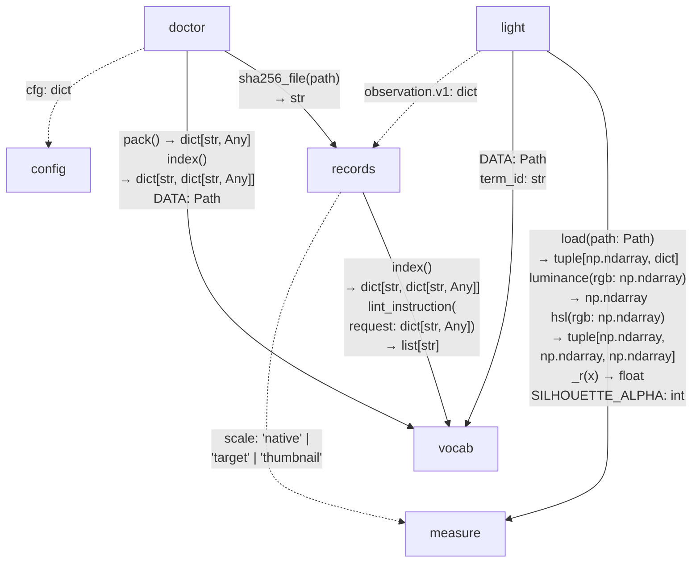

# `src/asrai/` — the package

Ten modules include transports, core owners and version metadata; **nothing in the core imports a
transport**, which is what makes invariant 9 (`CLI and MCP produce the same output for the same
fixture`) structural rather than a promise.

This page is the **feature realm's interior**, one level below the
[realm ledger](../../docs/architecture.md). Module count is not responsibility count: every module
drawn in the graph below owns an invariant, while `cli`, `server`, `profile` and `__init__` do not.
`profile` is the exception worth naming: it projects a cache, and the `cache` realm owns nothing by
construction, so a module that only writes one cannot own an invariant either.

## Owner dependencies

Arrows point from consumer to provider; labels contain only the signatures or data declarations
crossing that boundary, and a wrapped line is part of the same signature. `DATA: Path` and
`SILHOUETTE_ALPHA: int` describe inferred constant types, not newly declared interfaces. Solid edges
include Python references; dashed edges are data-only contracts, including values passed through
transports. `light` constructs observation dictionaries that `records` validates when submitted; it
does not call the validator or append records itself.

`doctor` consumes `config.load()` output through the transports, including `observer` and `_root`. The
scale literals accepted by `records` mirror the keys of `measure.v1.scales`. `light` uses canonical
vocabulary term IDs from surface policy and a literal ID in its observation builder; that dependency
remains even if the data directory moves. These are inferred data contracts, not additional typed
Python APIs, so the graph cannot be recovered faithfully from an import count. No core owner imports
`cli.py` or `server.py`, and the transports' fan-out is not an extra product responsibility.

| module | owns | public surface | the rule it enforces |
|---|---|---|---|
| `config.py` | `asrai.toml` in the project root, overlaid on defaults | `root`, `load`, `team_dir` | transports resolve configured project and team-corpus paths here |
| `vocab.py` | stock vocabulary v2 — lookup, search, locales, instruction lint | `get`, `search`, `categories`, `category`, `translations`, `langs`, `locale`, `localize`, `expand`, `compact`, `pack`, `index`, `lint_instruction`, `scalar_change`, `resolve_lang`, `locale_codes` | invariant 3 — a `proxy_only \| qualitative \| relational \| structural` term never takes `set` or a delta, and `lint` blocks it |
| `measure.py` | deterministic V0 measurement with Pillow and numpy | `load`, `measure`, `luminance`, `hsl`, `stats` | same bytes in, same JSON out. It never writes a file, and it refuses above 12 Mpx before decoding |
| `light.py` | the surface pass: `surfaces.v1` instantiated as a two-phase ledger | `ledger`, `surfaces` | direction may be measured; magnitude may not be invented. Every number it returns is a measurement, a count or a sign |
| `records.py` | append-only JSONL — `observation.v1`, `pairwise.v1`, `instruction.v2` | `validate`, `append`, `read`, `canonical_json`, `sha256_file`, `new_id` | invariants 6 and 12 — nothing is edited or deleted, and `L2_ONLY` terms stay `unknown` at L1 |
| `doctor.py` | the environment report and `asrai.lock.json` | `run`, `snapshot`, `tool_version`, `pinned_view` | invariant 14 — every run can say what it ran with, and drift is reported |
| `profile.py` | the overlay: what a team's records demonstrate about the vocabulary, cached beside them | `project`, `overlay`, `digest` | none. It is a projection of `records.jsonl`, and the [`cache` realm](../../docs/architecture.md) owns no invariant: a wrong row is deleted, never repaired |
| `cli.py` | the CLI transport | `main`, `build_parser` | one JSON document per command, printed, never written into an input |
| `server.py` | the stdio MCP transport | the seven tools below, `main` | the byte budget of spec.md §6: the tool surface measures 3,810 bytes and is held under 1,200 tokens by a test, and detail goes to `SKILL.md`; `retrieve` and `preview` are still to come |
| `__init__.py` | the version string | — | — |

MCP tools, and the CLI verb each mirrors:

| tool | CLI |
|---|---|
| `vocab_search` | `asrai vocab search` |
| `vocab_get` | `asrai vocab get \| category \| categories \| langs \| translations` |
| `measure` | `asrai measure` |
| `light_ledger` | `asrai light-ledger` |
| `record` | `asrai record` |
| `lint` | `asrai lint` |
| `doctor` | `asrai doctor` |

Not built: `retrieve`, `preview`, `apply`, `rasterize`, `render`. The bundled skill says so; an agent
that improvises them is a bug, not a feature.

## What this boundary currently exposes

- `light` imports `measure._r`, a private rounding helper, and `SILHOUETTE_ALPHA`. The private import
  violates the intended public boundary; drawing it records the defect rather than authorizing it.
- `light` reads its surface-policy file through `vocab.DATA`. That is a directory dependency, not a
  vocabulary lookup interface.
- `doctor` reaches `records` only for `sha256_file`. Environment reporting does not need the record
  lifecycle; the edge reflects where the generic helper currently lives.
- Observation dictionaries, configuration fields, scale keys and canonical term IDs cross owners
  without Python imports.

These are existing seams to address when their boundary is changed, not reasons to create new owners or
to refactor runtime code in a documentation change. The graph does not demand a subsystem split, does
not establish that the lighting policies are empirically valid, and does not pre-approve retrieval,
rendering, recipes or publishing. Evaluate those against the single job before adding them.

## Working here

- `light.py` carries its reasoning at the top. Read it before changing a threshold. The agreement
  cutoffs remain unverified implementation policy; do not mistake their presence for measured validity.
- A new measurement belongs in `measure.py` only if it is deterministic and asset-wide. Anything that
  needs a subject, an emitter or an observer belongs in `light.py`.
- A new field crossing the MCP or record boundary is a naming decision first: [docs/conventions.md](../../docs/conventions.md) §1.
- The contract is [docs/spec.md](../../docs/spec.md). When this file disagrees with it, spec.md wins.
