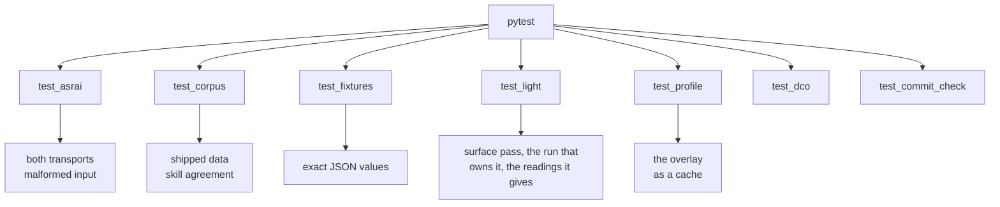

# `tests/` — package and policy checks

```bash
uv run pytest -q
```

It covers the code, the shipped corpus, and exact JSON values from
`measure` against committed fixtures — the corpus validators run *inside* pytest rather than beside it,
so a change to `vocab.v2.json` fails the same command a change to `light.py` does.



Collect the current counts with `uv run pytest --collect-only -q`; parametrised tests count separately.

| file | what it holds |
|---|---|
| `test_asrai.py` | vocabulary search/get/locales, lint rules, `measure` determinism, record validation and layer rules, `doctor` lock and drift, the MCP tools in-process **and** over stdio, refusal of malformed input at both trust boundaries, every number the documents claim against `claims.json`, the scanner that looks for the ones no row claims, and the MCP tool surface against its token budget |
| `test_corpus.py` | the shipped vocabulary validates, the locales carry no hard defect, the shipped `lint` and the vendored validator agree (both on acceptance and on rejection), every surface in `surfaces.v1.json` maps onto a real vocabulary term and is named in `SKILL.md`, and the skill names every `context` key the linter requires |
| `test_dco.py` | new commits need real signoff trailers; legacy history is exempt and unavailable history cannot pass |
| `test_commit_check.py` | real Git hooks accept/reject commit trees, message-only and staged amendments, owner-crossing renames, merges and linked worktrees; unavailable evidence and malformed trailers fail |
| `test_fixtures.py` | `measure` reproduces the committed JSON values for each of the six images, the CLI and the core agree, and a fully transparent asset is reported as empty rather than measured |
| `test_light.py` | the surface pass and the run that owns it. The pass: direction, emitters, key fit, the form, the answered phase, depth, the three modes, the estimator noise floor on every direction, the mirror check, capture boxes and what a capture could not read, subject masks, holds, and the production perturbations. The run: that it opens the asset and names the subjects alone, that a form belongs to the run it was filled for, that the record it builds is one the `record` tool stores, and that an axis saying warn or fail is backed by an observation. What presents it: three profiles saying one verdict three ways with the verdict and record byte-identical under each, the corpus overriding vocabulary and nothing else, and the import graph that stops a family choosing its own reader |
| `test_profile.py` | the overlay is a projection and never a source: a scope nobody wrote about is absent rather than clean, an append to the records reprojects it while deleting the cache costs only time, and a term the shipped vocabulary no longer carries is dropped rather than guessed at |

The [runbook](../docs/runbook.md) also requires repository link/stamp checks and a fresh wheel install.
`tools/check_wheel.py` checks the installed CLI and MCP from outside the checkout; it is intentionally
separate from the package suite, since it builds and installs a distribution.

## Conventions

**A test is named as a sentence about behaviour**, not after the function it calls:
`test_a_vignette_is_not_a_shaded_mass`, not `test_shadow_guard`. The name is the claim; when it fails,
the name alone should say what stopped being true.

**A test's docstring carries the story, not the mechanics.** The perturbation tests each name the
production case they came from — a default post-process volume, an export in the wrong colour space, a
file that came back through a tracker — because the magnitude is only defensible if the case is real.

**Every assertion carries its context**: `assert ..., (k, s["shadow"])`. A bare failure in a
parametrised loop costs a debugging round-trip that the third argument would have saved.

**A number a document states is registered in `claims.json`.** It holds the value, what computes it,
and the exact wording that must appear in each document claiming it, so a count that moves fails here
rather than drifting through the prose. Adding a number to a README means adding a row.

**No new dependency, no fixtures directory of mocks.** The synthetic scene in `test_light.py` (`disc()`)
is built from numpy in twelve lines and is exact, so an estimator's error is known and not assumed.

## Adding a test

1. If it asserts a promise, the promise belongs in [docs/spec.md](../docs/spec.md) first.
2. If it asserts a *number*, that number has to come from a measurement, a precedent or a human —
   never from what the code currently prints. Measure it, then assert it, and say in the docstring what
   measured it.
3. If it covers a defect found in a real asset, keep the real magnitude. A perturbation at a made-up
   strength proves nothing; a vignette of 0.10 proved a great deal precisely because it is invisible.
