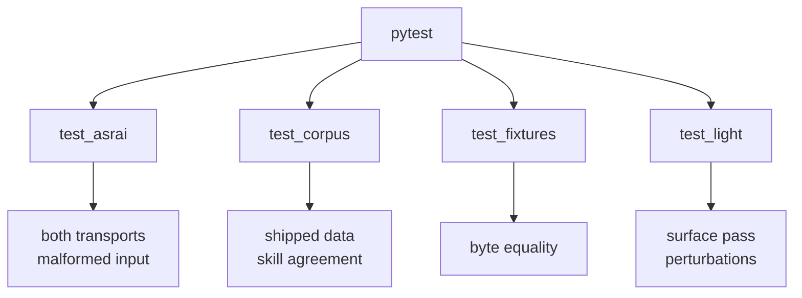

# `tests/` — the single gate

```bash
uv run pytest -q
```

There is one gate and this is it. It covers the code, the shipped corpus, and byte-equality of
`measure` against committed fixtures — the corpus validators run *inside* pytest rather than beside it,
so a change to `vocab.v2.json` fails the same command a change to `light.py` does.



| file | tests | what it holds |
|---|---|---|
| `test_asrai.py` | 10 | vocabulary search/get/locales, lint rules, `measure` determinism, record validation and layer rules, `doctor` lock and drift, the MCP tools in-process **and** over stdio, and refusal of malformed input at both trust boundaries |
| `test_corpus.py` | 5 | the shipped vocabulary validates, the locales carry no hard defect, the shipped `lint` and the vendored validator agree (both on acceptance and on rejection), and every surface in `surfaces.v1.json` maps onto a real vocabulary term and is named in `SKILL.md` |
| `test_fixtures.py` | 3 | `measure` reproduces the committed JSON byte for byte, the CLI and the core agree, and a fully transparent asset is reported as empty rather than measured |
| `test_light.py` | 18 | the surface pass: direction, emitters, key fit, the form, the answered phase, depth, the three modes, the estimator noise floor on every direction, the mirror check, capture boxes, subject masks, and the production perturbations |

## Conventions

**A test is named as a sentence about behaviour**, not after the function it calls:
`test_a_vignette_is_not_a_shaded_mass`, not `test_shadow_guard`. The name is the claim; when it fails,
the name alone should say what stopped being true.

**A test's docstring carries the story, not the mechanics.** The perturbation tests each name the
production case they came from — a default post-process volume, an export in the wrong colour space, a
file that came back through a tracker — because the magnitude is only defensible if the case is real.

**Every assertion carries its context**: `assert ..., (k, s["shadow"])`. A bare failure in a
parametrised loop costs a debugging round-trip that the third argument would have saved.

**No new dependency, no fixtures directory of mocks.** The synthetic scene in `test_light.py` (`disc()`)
is built from numpy in twelve lines and is exact, so an estimator's error is known and not assumed.

## Adding a test

1. If it asserts a promise, the promise belongs in [docs/spec.md](../docs/spec.md) first.
2. If it asserts a *number*, that number has to come from a measurement, a precedent or a human —
   never from what the code currently prints. Measure it, then assert it, and say in the docstring what
   measured it.
3. If it covers a defect found in a real asset, keep the real magnitude. A perturbation at a made-up
   strength proves nothing; a vignette of 0.10 proved a great deal precisely because it is invisible.
